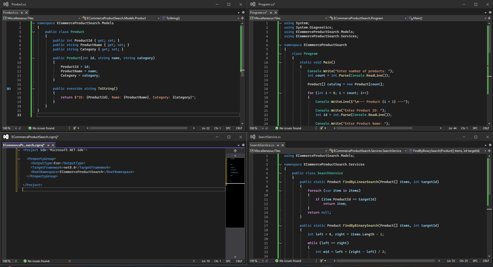
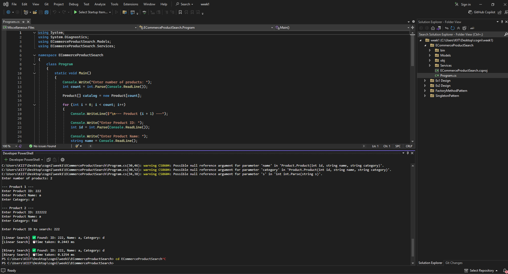

# 💻 E-Commerce Product Search using Linear and Binary Search in **C#**

Implement a product search utility using **Linear Search** and **Binary Search** in **C#**, ensuring performance comparison via execution time. This simulation models a product search feature in an e-commerce platform.

---

## 📁 Files Included

- **Product.cs** – Contains the Product class with ID, name, and category.
- **SearchService.cs** – Includes the logic for linear and binary search methods.
- **Program.cs** – Acts as the main entry point and compares both search methods using user input and Stopwatch.

---

## 🔎 How It Works

### 🧱 Product.cs  
This class defines the Product model by:
- Initializing `ProductId`, `ProductName`, and `Category`.
- Providing a constructor to populate the values.
- Overriding `ToString()` to display product details in a formatted string.

---

### 📌 SearchService.cs  
This class includes both search algorithms:
- **Linear Search:**
  - Iterates over the array one element at a time.
  - Time Complexity:
    - Best Case: O(1)
    - Worst Case: O(n)
- **Binary Search:**
  - Works only on sorted arrays.
  - Divides the array in half each time.
  - Time Complexity:
    - Best Case: O(1)
    - Worst Case: O(log n)

---

### 🧪 Program.cs  
This class runs the implementation by:
- Taking dynamic input for product details.
- Accepting a target Product ID to search.
- Performing Linear and Binary search respectively.
- Measuring time for each using `Stopwatch` to compare performance.

---

## 📸 Code Screenshot

📌 *Image from VS Code terminal showing product search implementation in C#:*

---

## 🖥 Output Screenshot

📌 Below is a screenshot of the terminal output verifying the search results and performance:

---

## 📊 Performance Comparison Table

| Search Method     | Best Case | Average Case | Worst Case | Sorted Required |
|------------------|-----------|--------------|------------|------------------|
| **Linear Search** | O(1)      | O(n)         | O(n)       | ❌ No            |
| **Binary Search** | O(1)      | O(log n)     | O(log n)   | ✅ Yes           |

---

## 💬 Sample Output

