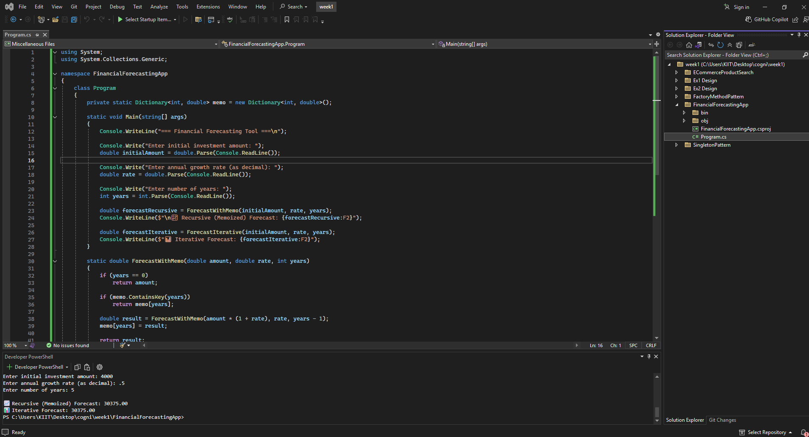
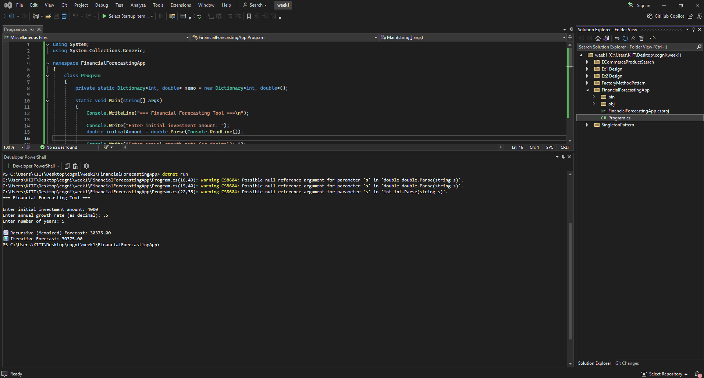

# 💰 Financial Forecasting using Recursion, Memoization & Iteration in C#

This project demonstrates how to predict the future value of an investment over time using different programming techniques in C#. It uses recursive functions, memoization (caching), and an iterative approach to calculate compound growth efficiently.

---

## 📁 Files Included

- **Program.cs** – The main driver program that:
  - Takes user input
  - Implements recursive forecasting
  - Implements iterative forecasting
  - Compares and prints both results

---

## 🔄 How It Works

### 📘 Forecasting Logic

- The future value is calculated based on this formula:
           Future Value = Present Value × (1 + Rate)^Years

### 🧮 Approaches Used

- **Recursive with Memoization**  
Each year’s value is calculated based on the previous one and stored to avoid recomputation.

- **Iterative**  
A simple loop is used to calculate growth year by year, which is more efficient in terms of memory.

---

## 💻 Program Flow

1. User is asked to enter:
 - Initial investment amount
 - Annual growth rate (as a decimal)
 - Number of years to forecast
2. Program calculates future value using:
 - Recursive method with memoization
 - Iterative method
3. Both results are displayed and compared

---

## 📸 Code Screenshot

📌 *VS Code preview showing recursive and iterative forecasting logic:*

    

---

## 🖥 Output Screenshot

📌 *Sample terminal output showing forecast results and comparison:*

    

---

## 📊 Performance Comparison Table

| Method               | Time Complexity | Space Complexity | Notes                                |
|----------------------|------------------|-------------------|----------------------------------------|
| Recursive (no memo)  | O(n)             | O(n)              | Deep call stack                       |
| Recursive + Memo     | O(n)             | O(n)              | Prevents redundant computation        |
| Iterative            | O(n)             | O(1)              | Most efficient for large input sizes |

---

