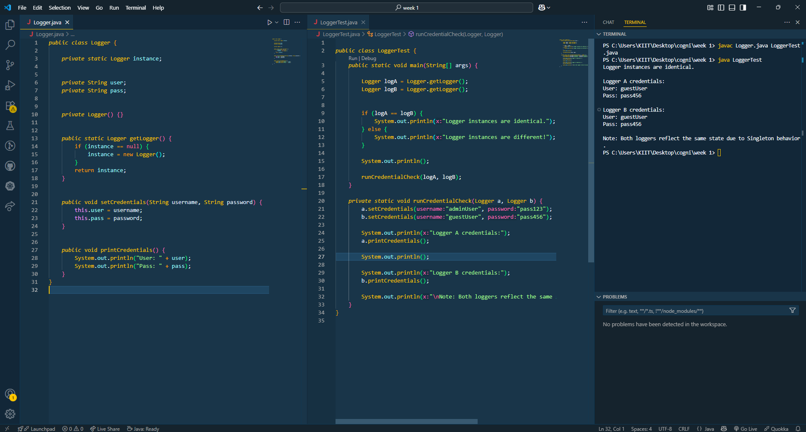
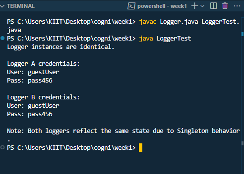

# ✅ Exercise 1: Implementing the Singleton Pattern

## 📘 Objective
	Implement a logging utility class in Java using the **Singleton Design Pattern**
	to ensure only **one instance** is used throughout the application for consistent behavior.

---

## 📁 Files Included

	- `Logger.java` — Implements the Singleton class.
	- `LoggerTest.java` — Tests and demonstrates Singleton behavior.

---

## 🧱 How It Works

### 🔹 Logger.java
	- Defines a Singleton class called `Logger`.
	- Uses a **private static variable** `instance` to store the single object.
	- Has a **private constructor** to prevent creating new instances.
	- Provides a `public static Logger getLogger()` method to return the same object each time.
	- Contains:
		- `setCredentials(String username, String password)` — to set user info.
		- `printCredentials()` — to print stored credentials.

### 🔹 LoggerTest.java
	- Calls `Logger.getLogger()` twice to get `logA` and `logB`.
	- Compares both objects using `==` to prove they're the **same instance**.
	- Sets different credentials using both references.
	- Prints credentials from both to show they **share the same internal state**.

---

## 🖼️ Code & Output Screenshot

📌 *Image from VS Code terminal showing Singleton test run:*
 

---

## 📤 Sample Output

