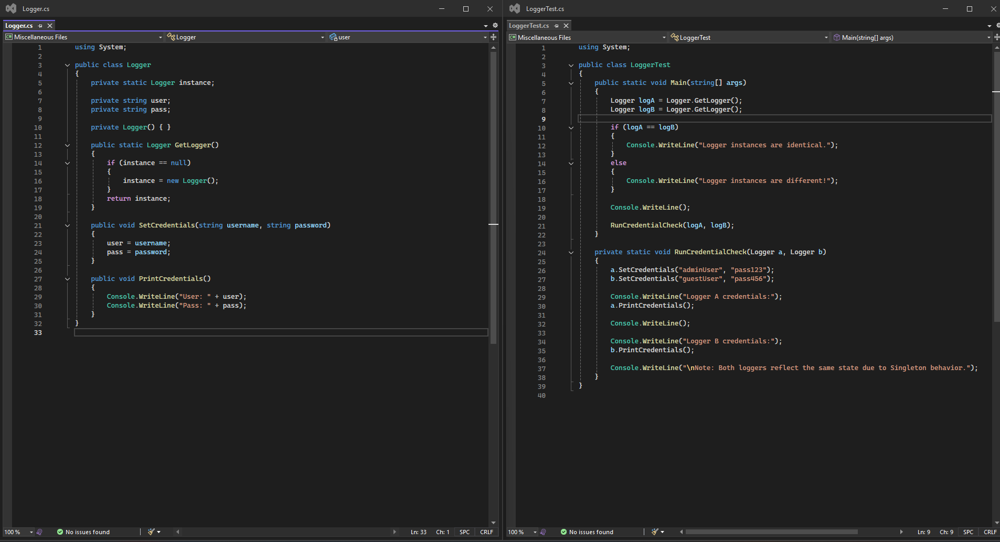
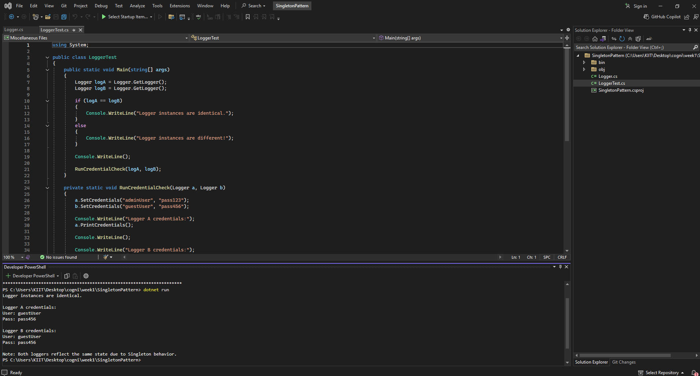

# ✅ Exercise 1: Implementing the Singleton Pattern (C#)

## 📘 Objective  
Implement a logging utility using the Singleton Design Pattern in **C#**, ensuring that only one instance of the logger class is used across the application to maintain consistent state.

---

## 📁 Files Included

- **Logger.cs** — Contains the Singleton class responsible for managing user credentials.
- **LoggerTest.cs** — Contains the main entry point and tests the singleton behavior using the logger instance.

---

## 🧱 How It Works

### 🔹 Logger.cs  
This class implements the Singleton Pattern by:
- Declaring a private static variable to store the single instance.
- Using a private constructor to prevent external object creation.
- Providing a static method to access the single instance.
- Including methods to set and print user credentials.

### 🔹 Program.cs  
This class tests the Singleton implementation by:
- Creating two references via the static method.
- Verifying both references point to the same object.
- Setting and printing credentials through each reference to show that state is shared.

---

## 🖼️ Code Screenshot

📌 *Image from VS Code Community terminal showing Singleton code :*

## 🖼️ Output Screenshot

📌 Below is a screenshot of the terminal output verifying the singleton behavior:

