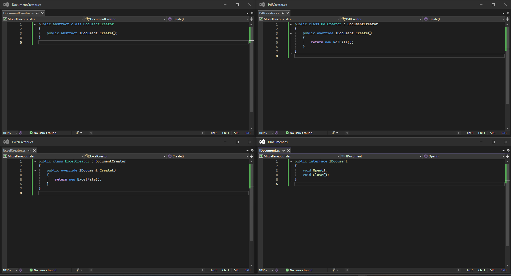
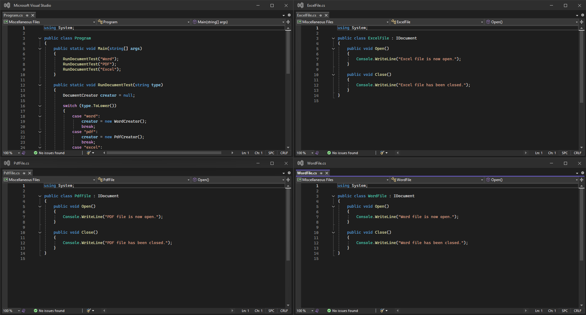
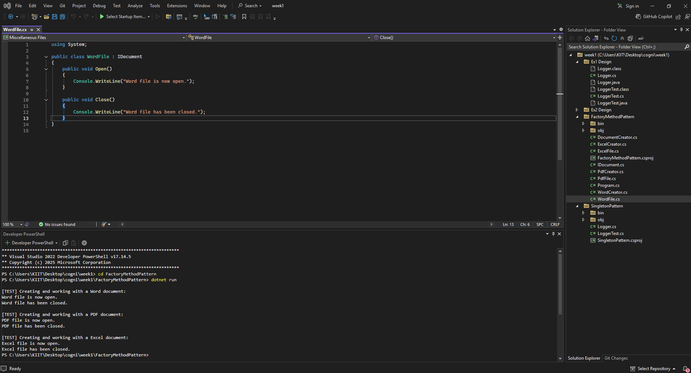

# ✅ Exercise 2: Implementing the Factory Method Pattern

## 📘 Objective  
	Develop a document management system in **C#** using the **Factory Method Design Pattern**  
	to allow the creation of different types of documents (**Word, PDF, Excel**) at runtime  
	without modifying the core application logic.

---

## 📁 Files Included

	- `IDocument.cs` — Interface for all document types (defines Open and Close).
	- `WordFile.cs` — Concrete Word document class.
	- `PdfFile.cs` — Concrete PDF document class.
	- `ExcelFile.cs` — Concrete Excel document class.
	- `DocumentCreator.cs` — Abstract Factory class.
	- `WordCreator.cs` — Factory class for Word documents.
	- `PdfCreator.cs` — Factory class for PDF documents.
	- `ExcelCreator.cs` — Factory class for Excel documents.
	- `Program.cs` — Main class that tests document creation and simulates usage.

---

## 🧱 How It Works

### 🔹 IDocument.cs  
	- Interface that defines two actions every document must implement:
		- `Open()` — Simulates opening the file.
		- `Close()` — Simulates closing the file.

### 🔹 Concrete Document Classes  
	- `WordFile`, `PdfFile`, `ExcelFile` implement `IDocument`.
	- Each class provides a custom message for both Open and Close.

### 🔹 Factory Classes  
	- `DocumentCreator` is the abstract factory with method `Create()`.
	- `WordCreator`, `PdfCreator`, `ExcelCreator` inherit from it and return specific document types.

### 🔹 Program.cs  
	- Contains a `RunDocumentTest(string type)` method.
	- Accepts a type (`Word`, `PDF`, `Excel`) and uses the corresponding factory to:
		- Create the document.
		- Call `Open()` and `Close()` methods to simulate usage.
	- Demonstrates how Factory Method enables **scalable and clean object creation**.

---

## 🖼️ Code & Output Screenshot

📌 *Image from VS Code terminal showing Factory Method code:*  
        
        
⬇️ Add your image below:  

---

## 📤 Sample Output

