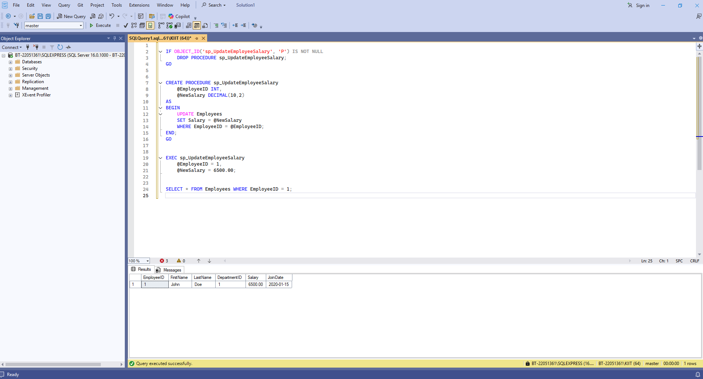
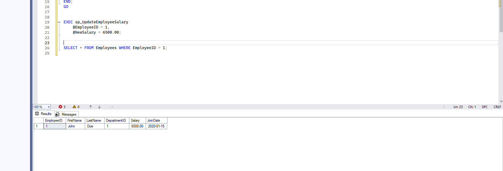

# ✅ Exercise 4: Stored Procedure – Update Employee Salary

## 📘 Objective  
Create a stored procedure in **SQL Server** that allows updating  
	an employee’s salary using input parameters.

---

## 📁 Files Included

- `Exercise4_UpdateEmployeeSalary.sql` — SQL script that:
		▪ Defines procedure `sp_UpdateEmployeeSalary`  
		▪ Accepts EmployeeID and new salary as parameters  
		▪ Executes an `UPDATE` query on the `Employees` table  
		▪ Includes example execution for validation

---

## 🧾 Table Reference

### 🔸 Employees

	+------------+----------------+------------------------------+
	| Column     | Data Type      | Description                  |
	+------------+----------------+------------------------------+
	| EmployeeID | INT            | Primary Key                  |
	| FirstName  | VARCHAR(50)    | Employee's first name        |
	| LastName   | VARCHAR(50)    | Employee's last name         |
	| Salary     | DECIMAL(10,2)  | Monthly salary (to update)   |
	+------------+----------------+------------------------------+

---

## 🧱 Procedure Logic

```sql
CREATE PROCEDURE sp_UpdateEmployeeSalary
    @EmployeeID INT,
    @NewSalary DECIMAL(10,2)
AS
BEGIN
    UPDATE Employees
    SET Salary = @NewSalary
    WHERE EmployeeID = @EmployeeID;
END;
```
---
## 🖼️ Code Screenshot
📌 *CODE VIEW*

---
## 📤 Output Screenshot
📌 *SSMS output screenshot:* 

---
