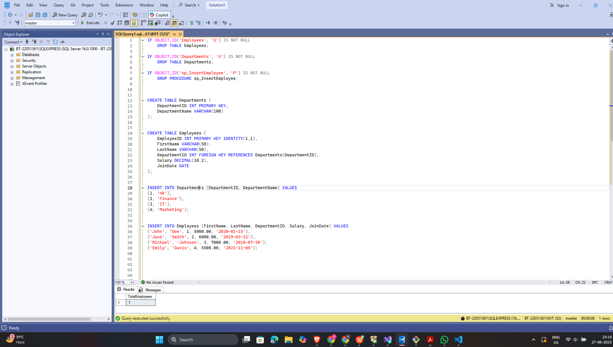
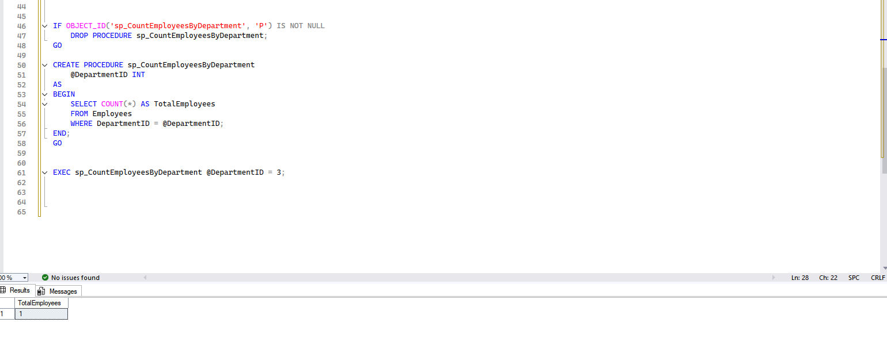

# ✅ Exercise 3: Stored Procedure(EX-5) – Count Employees by Department

## 📘 Objective  
Create a stored procedure in **SQL Server** that returns the total number of employees  
	in a specified department using the `COUNT(*)` function.

---

## 📁 Files Included

- `Exercise5_CountEmployees.sql` — SQL script that:
		▪ Drops existing procedure if it exists
		▪ Defines the stored procedure `sp_CountEmployeesByDepartment`
		▪ Returns employee count for the given DepartmentID
		▪ Includes example EXEC statement for testing

---

## 🧾 Table Schema (Used Table)

	+------------+----------------+------------------------------+
	| Column     | Data Type      | Description                  |
	+------------+----------------+------------------------------+
	| EmployeeID | INT (IDENTITY) | Primary Key                  |
	| FirstName  | VARCHAR(50)    | First name of employee       |
	| LastName   | VARCHAR(50)    | Last name of employee        |
	| DepartmentID| INT           | Foreign Key to Departments   |
	| Salary     | DECIMAL(10,2)  | Employee salary              |
	| JoinDate   | DATE           | Date employee joined         |
	+------------+----------------+------------------------------+

---

## 🧱 How It Works

### 🔹 Stored Procedure Logic

▪ Name: sp_CountEmployeesByDepartment
	▪ Accepts: @DepartmentID (INT)
	▪ Uses COUNT(*) to count all employees in the given department
	▪ Returns a single result row with alias: TotalEmployees
---
## 🖼️ Code Screenshot
📌 *CODE VIEW* 

## 📤 Output Screenshot
📌 *SSMS output screenshot*  

