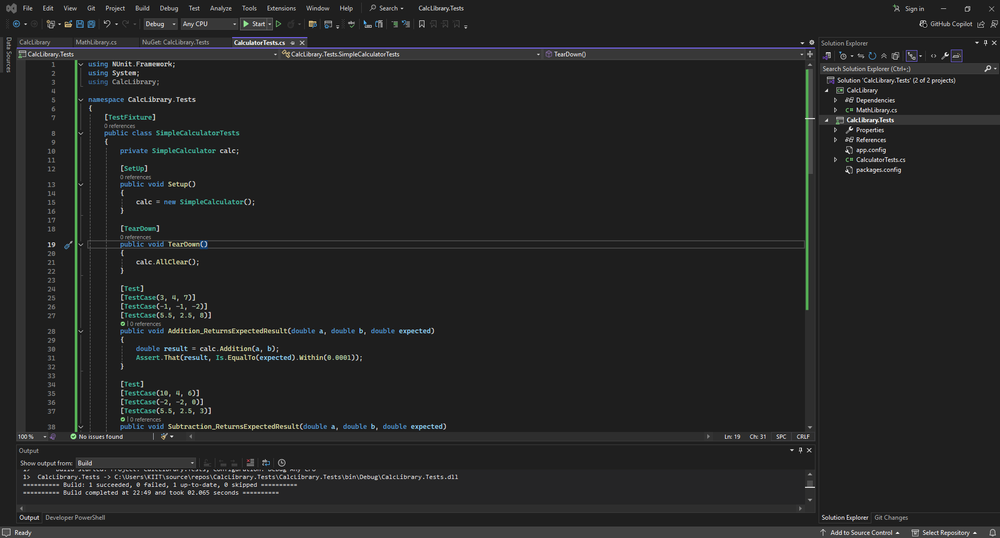
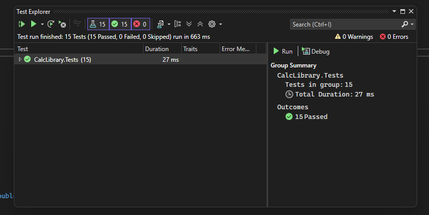

# ✅ Exercise 1: Unit Testing a Calculator using NUnit

## 📘 Objective  
Build and validate a simple calculator using **C# and NUnit**, applying structured unit test cases  
to ensure each arithmetic operation works correctly — including edge cases like division by zero.  
Use best practices like `SetUp`, `TearDown`, `TestCase`, and assertion-based validation.

---

## 📁 Files Included

`SimpleCalculator.cs` — Core calculator logic with operations:  
▪ Addition, Subtraction, Multiplication, Division  
▪ Internal result management via `GetResult` and `AllClear()`  

`SimpleCalculatorTests.cs` — NUnit test class that:  
▪ Verifies each operation with multiple input combinations  
▪ Validates edge cases (e.g., divide-by-zero)  
▪ Uses `[SetUp]`, `[TearDown]`, and `[TestCase]`  

---

## 🧾 Class Summary

```
+------------------------+--------------------------------------------+
| Method / Property      | Description                                |
+------------------------+--------------------------------------------+
| Addition(a, b)         | Returns sum of a and b                     |
| Subtraction(a, b)      | Returns difference of a and b              |
| Multiplication(a, b)   | Returns product of a and b                 |
| Division(a, b)         | Returns quotient or throws error if b == 0 |
| AllClear()             | Resets internal result to zero             |
| GetResult              | Returns the most recent operation result   |
+------------------------+--------------------------------------------+
```

---

## 🧱 How It Works

### 🔹 Setup  
- A new instance of `SimpleCalculator` is created for every test using `[SetUp]`.  
- `[TearDown]` resets the state after each test.

### 🔹 Test Logic Flow

1. **Test Methods:**

```
+----------------------------------------+-------------------------------+
| Test Method                            | Description                   |
+----------------------------------------+-------------------------------+
| Addition_ReturnsExpected               | Validates sum results         |
| Subtraction_ReturnsExpected            | Validates difference results  |
| Multiplication_ReturnsExpected         | Validates product results     |
| Division_ReturnsExpected               | Validates correct quotient    |
| Division_ByZero_ThrowsException        | Catches division by zero      |
| AllClear_SetsResultToZero              | Resets state to 0             |
| GetResult_ReturnsLastValue             | Returns most recent output    |
+----------------------------------------+-------------------------------+
```


3. **Exception Handling:**

```csharp
[Test]
public void Division_ByZero_ThrowsException()
{
    var ex = Assert.Throws<ArgumentException>(() => calc.Division(5, 0));
    Assert.That(ex.Message, Is.EqualTo("Second Parameter Can't be Zero"));
}
```

---

## 🛠️ Setup Instructions

1. Open `CalcLibrary.sln` in Visual Studio.  
2. Install NuGet packages in the test project:
   - `NUnit`  
   - `NUnit3TestAdapter`  
   - `Microsoft.NET.Test.Sdk`  
3. Build the solution (`Ctrl + Shift + B`)  
4. Open **Test Explorer** → Click **Run All**

---

## 🖼️ Code Screenshot  
📌 *Test method in Visual Studio:*  


---

## 📤 Output Screenshot  
📌 *Test Explorer output showing all tests passing:*  


---


