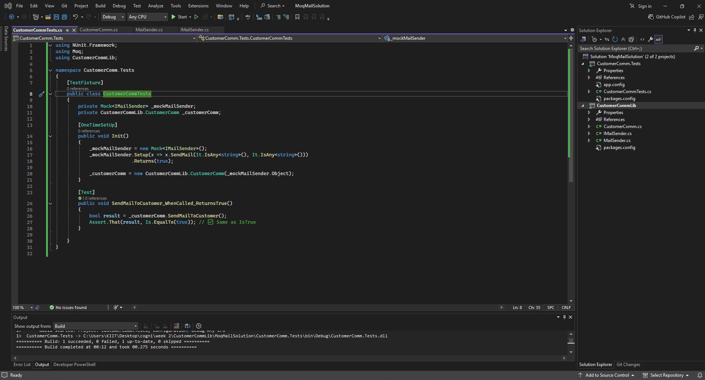
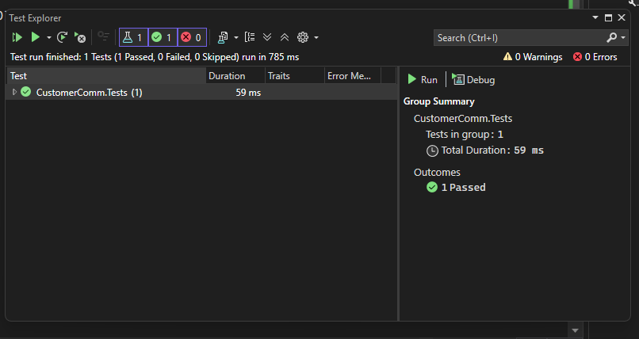

# ✅ Exercise 2: Unit Testing Email Sending using Moq

## 📘 Objective  
Build and validate a testable email communication module using **C#**, **Moq**, and **NUnit**, without actually sending real emails.  
The goal is to isolate dependencies using **Dependency Injection (DI)** and apply structured unit testing and mocking practices.  
Best practices like `SetUp`, `TestFixture`, `Mock`, and assertion-based validation are applied to simulate external systems like SMTP.

---

## 📁 Files Included

`IMailSender.cs` — Email interface abstraction used to allow mocking  
▪ Declares `SendMail(string toAddress, string message)`  

`MailSender.cs` — SMTP-based concrete implementation of `IMailSender`  
▪ Uses `SmtpClient` to send actual emails (excluded in testing)  

`CustomerComm.cs` — Logic layer that calls `SendMail()` using injected `IMailSender`  
▪ Implements constructor injection to accept dependency  

`CustomerCommTests.cs` — NUnit test class with `Moq`  
▪ Mocks `IMailSender`  
▪ Verifies the logic flow of sending mail  
▪ Uses `[SetUp]`, `Moq.Mock<>`, and `Assert.That(...)`

---

## 🧾 Class Summary

+------------------------+----------------------------------------------------+
| Class / Method        | Description                                         |
+------------------------+----------------------------------------------------+
| IMailSender           | Interface to abstract email-sending logic           |
| MailSender            | Uses SMTP client to send real emails                |
| CustomerComm          | Sends email through injected IMailSender            |
| SendMailToCustomer()  | Calls SendMail with fixed data and returns true     |
| CustomerCommTests     | Tests CustomerComm using Moq                        |
+------------------------+----------------------------------------------------+

---


## 🧱 How It Works

### 🔹 Setup  
- `IMailSender` enables mocking for external email systems  
- `CustomerComm` accepts `IMailSender` via constructor injection  
- During testing, a **mock object** is passed using **Moq** instead of real `MailSender`

---

### 🔹 Test Logic Flow

1. **Test Methods:**

+---------------------------------------------+-------------------------------+
| Test Method                                 | Description                   |
+---------------------------------------------+-------------------------------+
| SendMailToCustomer_WhenCalled_ReturnsTrue   | Verifies return from mock     |
+---------------------------------------------+-------------------------------+

---

## 🛠️ Setup Instructions

```bash
 1. Open the solution in Visual Studio
MoqMailSolution.sln

 2. In the test project (CustomerComm.Tests), install the following NuGet packages:
   You can use the NuGet Package Manager or run these in the Package Manager Console:

Install-Package Moq
Install-Package NUnit
Install-Package NUnit3TestAdapter
Install-Package Microsoft.NET.Test.Sdk

 3. Build the solution (Shortcut: Ctrl + Shift + B)

 4. Open the Test Explorer from:
 Test → Test Explorer → Click "Run All" to execute all unit tests

---

## 🖼️ Code Screenshot  
📌 *Test method in Visual Studio:* 


---

## 📤 Output Screenshot  
📌 *Test Explorer output showing all tests passing:* 


---