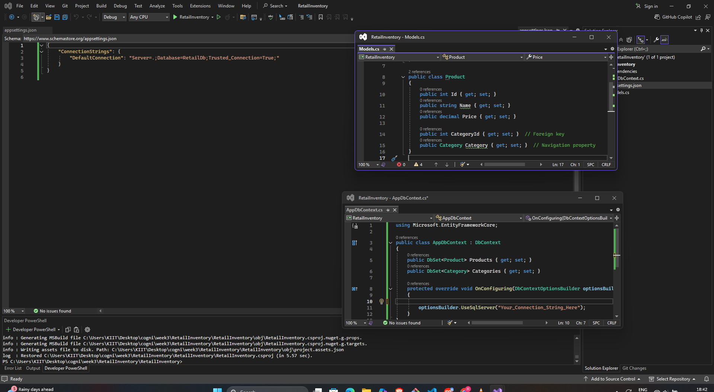

# ✅ Lab 2: Setting Up the Database Context

## 📘 Objective  
Configure the EF Core database context for a retail store app. Define entity models (`Product` and `Category`), and set up the `AppDbContext` class to connect the application with a SQL Server database.

---

## 📁 Files Included

`Models.cs` — Contains the entity classes:  
▪ `Category` model with navigation property to Products  
▪ `Product` model with foreign key to Category  

`AppDbContext.cs` — Database context class that:  
▪ Declares `DbSet<Product>` and `DbSet<Category>`  
▪ Configures SQL Server connection string in `OnConfiguring`

---

## 🛠️ Setup Instructions

1. Ensure `Microsoft.EntityFrameworkCore.SqlServer` and `Microsoft.EntityFrameworkCore.Design` packages are installed.
2. Create and save `Models.cs` and `AppDbContext.cs` in your console app project.
3. Confirm the database connection string is valid and points to your SQL Server instance.

---
## 🖼️ Code Screenshot  
📌 *Test method in Visual Studio:*  

---
## ✅ Output

✔ Models and `AppDbContext` configured  
✔ Ready for database creation and schema migrations  

---
