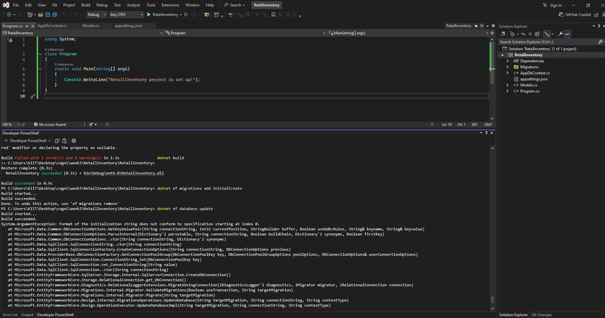

# ✅ Lab 3: Creating and Applying Migrations

## 📘 Objective  
Use EF Core CLI tools to generate and apply schema migrations based on your entity models. This will create the actual database structure in SQL Server.

---

## 📁 Files Affected

- `AppDbContext.cs` — Used as the source for generating migration code  
- `Migrations/` folder — Auto-generated folder with migration snapshot and instructions  
- SQL Server — Where the actual database is created after applying the migration

---

## 🧾 Command Summary

```
+-------------------------------+--------------------------------------------+
| Command                       | Purpose                                    |
+-------------------------------+--------------------------------------------+
| dotnet tool install -g dotnet-ef | Installs EF Core CLI tools globally      |
| dotnet ef migrations add <Name> | Creates migration files based on models  |
| dotnet ef database update        | Applies migration and creates database   |
+-------------------------------+--------------------------------------------+
```

---

## 🧱 How It Works

### 🔹 Step 1: Install EF Core CLI Tool (only once)

```bash
dotnet tool install --global dotnet-ef
```

This gives access to EF commands like `migrations` and `database update`.

---

### 🔹 Step 2: Add Initial Migration

```bash
dotnet ef migrations add InitialCreate
```

✅ This command:
- Scans your models and `DbContext`
- Creates a new folder named `Migrations/`
- Inside it, EF Core writes code to define the structure of your `Products` and `Categories` tables

---

### 🔹 Step 3: Apply Migration to Create the Database

```bash
dotnet ef database update
```

✅ This command:
- Executes the migration SQL
- Creates the actual database and tables in SQL Server using your connection string

---

## 🖥️ Visual Confirmation

1. Open SQL Server Management Studio (SSMS) or Azure Data Studio  
2. Connect to your database instance  
3. Expand your database → Tables  
4. Confirm tables `Products` and `Categories` are present

---

## 🛠️ Troubleshooting

- If you get an error about `dotnet-ef` not found, make sure it was installed globally
- Make sure `AppDbContext.cs` has the correct `UseSqlServer(...)` connection string
- If using separate projects (e.g., Class Library for context), add `--startup-project` and `--project` to CLI commands

---

## 📤 Output Screenshot  
📌 *Test Explorer output :*  

---
## ✅ Output

✔ Migration successfully created  
✔ Database schema applied  
✔ SQL Server tables verified  

---
