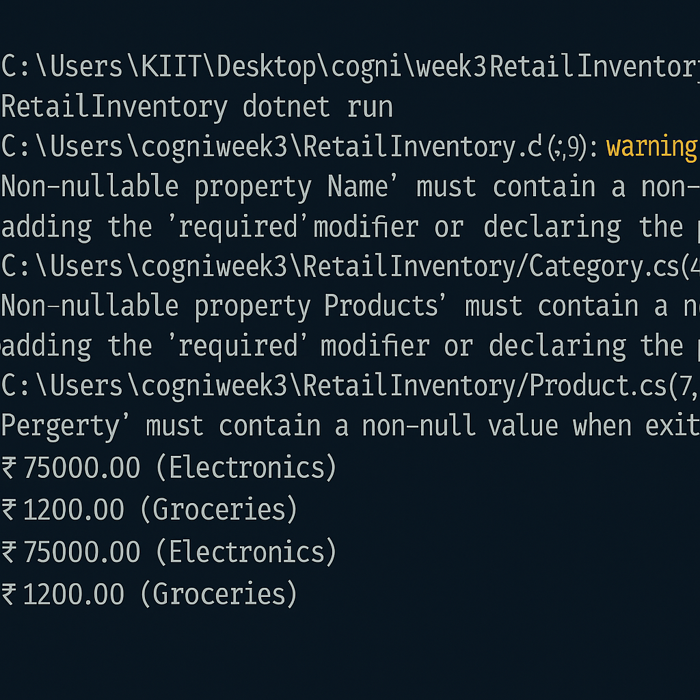

# ✅ Lab 4: Inserting Initial Data into the Database

## 📘 Objective  
Use EF Core to insert default categories and products into the SQL Server database. This simulates preloading inventory data during the initial setup of a retail system.

---

## 📁 Files Modified

- `Program.cs` — Updated to include asynchronous insert logic using `AddRangeAsync` and `SaveChangesAsync`

---

## ⚙️ How It Works

| Action                  | Code Used                      |
|-------------------------|-------------------------------|
| Add categories/products | `AddRangeAsync()`              |
| Save changes            | `SaveChangesAsync()`           |
| Link via navigation     | Assign `Category` to `Product` |

✅ EF Core handles foreign key relationships automatically when navigation properties are set.

---

## ▶️ Execution

Run the application:

```bash
dotnet run
```

Expected output:

```
✅ Initial data inserted successfully.
```

---

## 🗃️ Verify in SQL Server

Use SSMS or Azure Data Studio:

```sql
SELECT * FROM Categories;
SELECT * FROM Products;
```

You should see:
- Categories: **Electronics**, **Groceries**
- Products: **Laptop**, **Rice Bag**

---
## 📤 Output Screenshot  
📌 *Test Explorer output showing all tests passing:*  
    
---
## ✅ Output Summary

✔ Data seeded via C#  
✔ `AddRangeAsync` used for batching  
✔ Products linked to Categories using navigation properties

---

