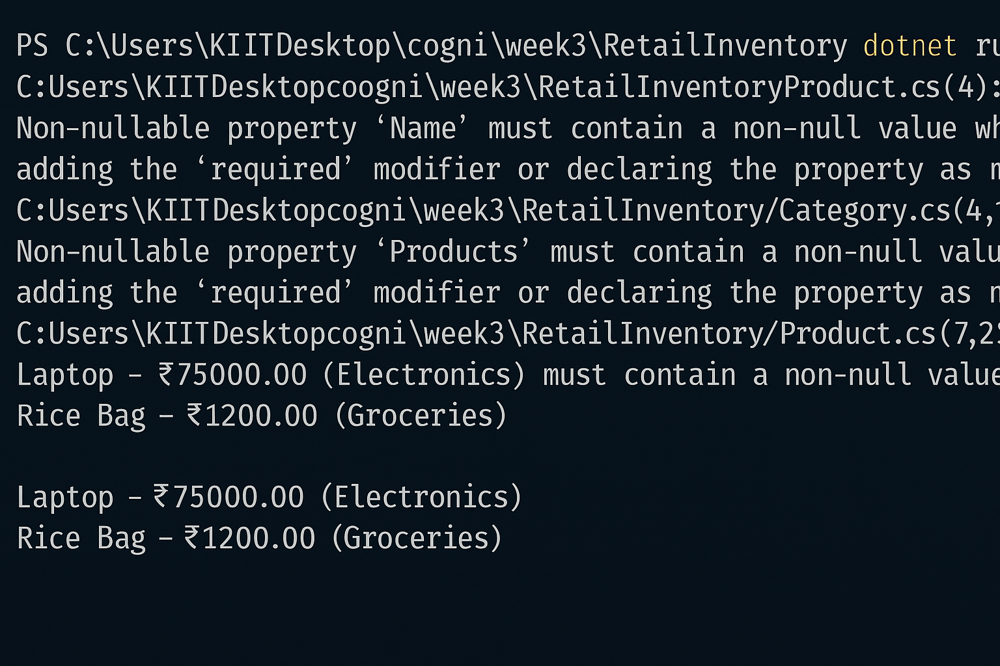

# ✅ Lab 5: Retrieving Data from the Database

## 📘 Objective  
Fetch and display product information from the database using EF Core's query methods like `ToListAsync()`, `FindAsync()`, and `FirstOrDefaultAsync()`.

---

## 📁 Files Modified

- `Program.cs` — Updated to retrieve and display records after insertion


---

## ⚙️ How It Works

| Method Used             | Purpose                                      |
|-------------------------|----------------------------------------------|
| `ToListAsync()`         | Fetch all records from the table             |
| `FindAsync(id)`         | Locate an entity by its primary key (ID)     |
| `FirstOrDefaultAsync()` | Fetch first entity matching a condition      |
| `?.Name ?? "Fallback"`  | Handles null values safely when printing     |

---

## ▶️ Execution

Run the application:

```bash
dotnet run
```

### 🖥️ Example Output

```
📦 All Products:
- Laptop | ₹75000
- Rice Bag | ₹1200

🔍 Product with ID 1: Laptop

💰 Expensive Product: Laptop
```

---

## 📤 Output Screenshot  
📌 *Test Explorer output showing all tests passing:*  

---
## ✅ Output Summary

✔ Products retrieved and displayed using EF Core queries  
✔ Demonstrated lookup by ID and conditional search  
✔ LINQ + async EF methods used for clean and efficient access

---

