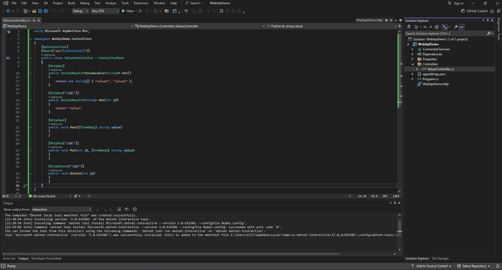
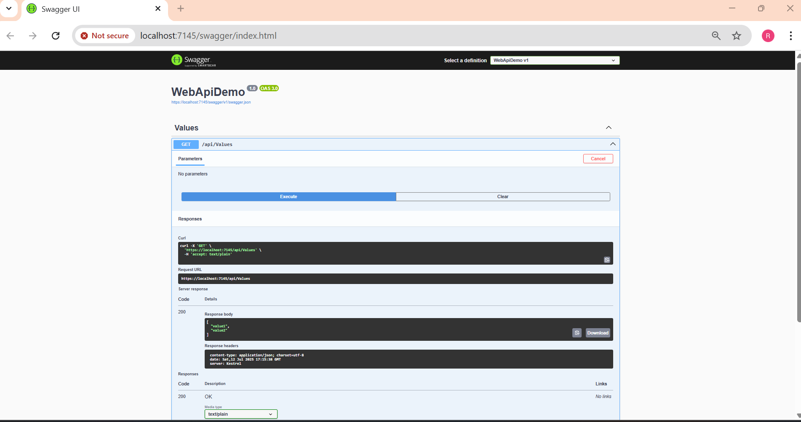

# ✅ ASP.NET Core Web API – Hands-On Lab

This project demonstrates how to build and run a basic RESTful Web API using **ASP.NET Core** with **GET, POST, PUT, DELETE** operations and test it using **Swagger UI**.

---

## 📘 Objectives

- Understand RESTful services, Web API, Microservices
- Learn HTTP methods and status codes
- Create and configure a Web API project
- Add and test controller actions
- Handle browser HTTPS certificate issues

---

## 🛠 Prerequisites

- Visual Studio 2022 or later
- .NET 6 or 7 SDK
- Browser (Chrome/Edge)
- Optional: Postman

---

## 🖼️ Code Screenshot  
📌 *Screenshot of  Visual Studio:* 

## 📤 Output Screenshot  
📌 *output showing required result:* 
