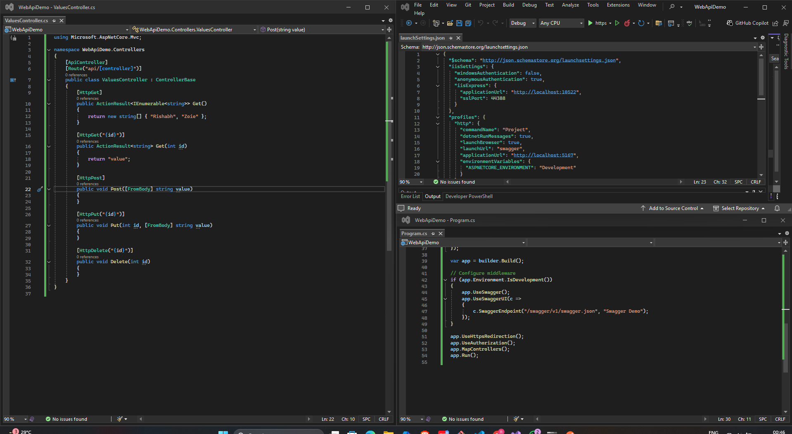
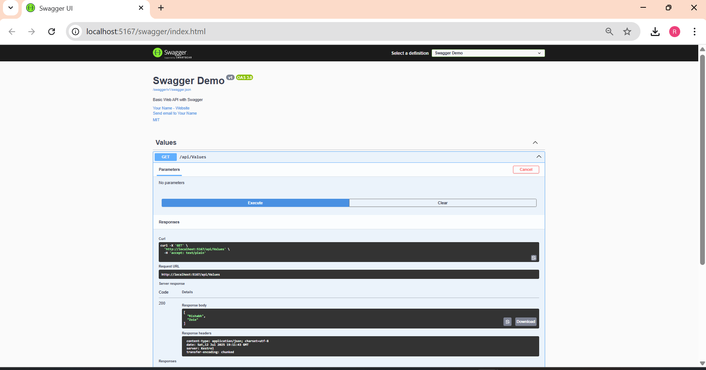
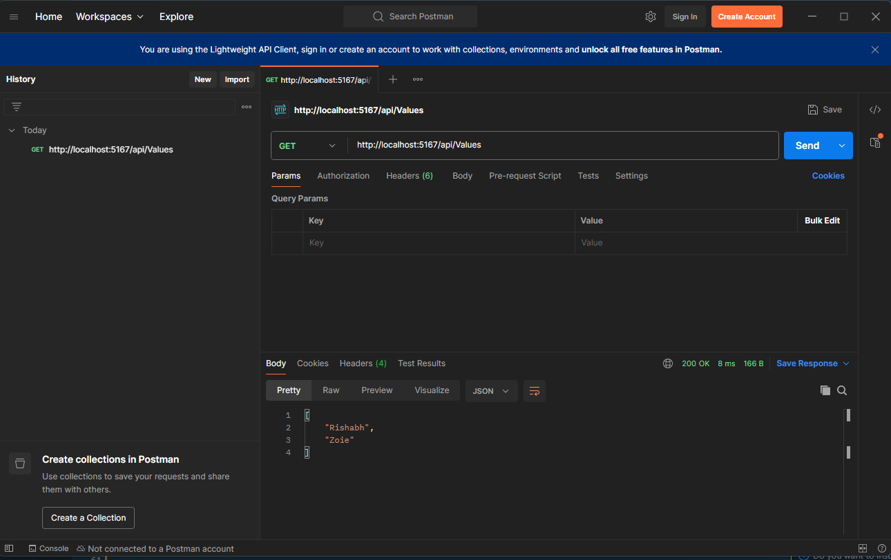
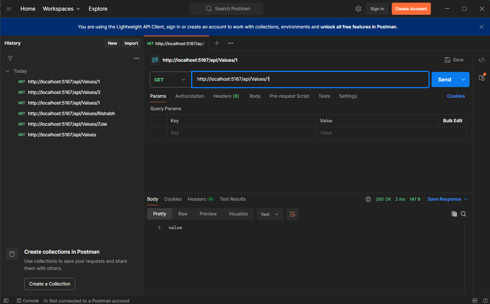

# ✅ ASP.NET Core Web API – Hands-On Lab -2

This project demonstrates how to create a Web API with **Swagger UI integration**, implement full **CRUD operations**, and test the endpoints using both **Swagger** and **Postman**.

---

## 📘 Objectives

- Add Swagger to ASP.NET Core Web API using Swashbuckle
- Create API endpoints with `[HttpGet]`, `[HttpPost]`, `[HttpPut]`, `[HttpDelete]`
- Use `[Route]`, `[ActionName]`, and `[ProducesResponseType]` attributes
- Test the API using Swagger and Postman
- Enable CORS to allow Postman testing
- Launch Web API securely using HTTPS

---

## 🛠 Prerequisites

- Visual Studio 2022 or later
- .NET 6 or 7 SDK
- Postman installed
- Modern browser (Chrome, Edge)
- Swagger NuGet package (`Swashbuckle.AspNetCore`)

---

## 📁 Project Structure

```
WebApiDemo/
├── Controllers/
│   └── ValuesController.cs
├── Properties/
│   └── launchSettings.json
├── Program.cs
```

---


### ✅ Using Postman

#### 🔹 Base URL:
```
http://localhost:5167/api/Values
```


---

## 🖼️ Code Screenshot  
📌 *Screenshot of  Visual Studio:* 


---
## 📤 Output Screenshot 
###  Swagger UI Screenshot  
📌 *Screenshot of working Swagger interface:*  


---

###  Postman Test Screenshot  
📌 *Successful API testing using Postman:*  




---


