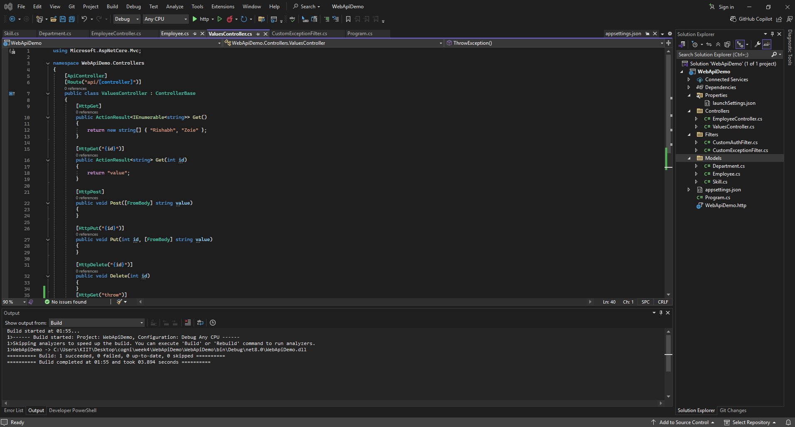

# ✅ ASP.NET Core Web API – Hands-On Lab -3

This project demonstrates how to build a custom Web API using **Swagger UI integration**, implement full **CRUD operations** with custom models, authorization and exception filters, and test the endpoints using both **Swagger** and **Postman**.

---

## 📘 Objectives

- **Create custom model classes** (`Employee`, `Department`, `Skill`)
- **Implement CRUD endpoints** with `[HttpGet]`, `[HttpPost]`, `[HttpPut]`
- Use `[Route]`, `[ProducesResponseType]`, `[FromBody]`, and `[AllowAnonymous]` attributes
- **Add and use custom action filters** for authorization and exception handling
- **Test the API** using Swagger and Postman
- **Enable CORS** for Postman testing
- **Launch Web API securely** using HTTPS

---

## 🛠 Prerequisites

- **Visual Studio 2022** or later
- **.NET 6 or 7 SDK**
- **Postman** installed
- **Modern browser** (Chrome, Edge)
- **Swagger NuGet package** (`Swashbuckle.AspNetCore`)
- *(Optional)* `Microsoft.AspNetCore.Mvc.WebApiCompatShim` NuGet package

---

## 📁 Project Structure

WebApiDemo/
├── Controllers/
│   ├── EmployeeController.cs
│   └── ValuesController.cs
├── Filters/
│   ├── CustomAuthFilter.cs
│   └── CustomExceptionFilter.cs
├── Models/
│   ├── Employee.cs
│   ├── Department.cs
│   └── Skill.cs
├── Properties/
│   └── launchSettings.json
├── Program.cs
├── appsettings.json

---

## 🖼️ Code Screenshot

📌 *Screenshot of Visual Studio:*  

---

## 📤 Output Screenshot

### **Swagger UI Screenshot**

---
