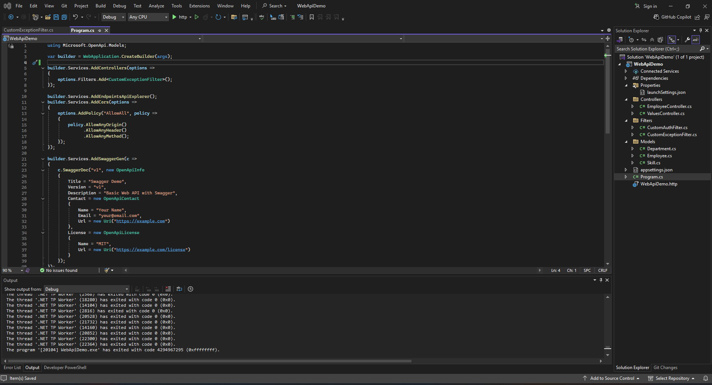

# ✅ ASP.NET Core Web API – Hands-On Lab -4

This project demonstrates how to **update Employee data** using the Web API's PUT method, leveraging `[FromBody]` for model binding, and validating inputs as per assignment requirements. The API is tested using both **Swagger UI** and **Postman**.

---

## 📘 Objectives

- **Implement the update (PUT) operation** for Employee data
- Use `[FromBody]` to extract and update model data from the request body
- Validate employee `id` and return appropriate responses
- Return the updated Employee object on success
- Test the API using **Swagger** and **Postman**
- Ensure error handling for invalid or missing employee IDs

---

## 🛠 Prerequisites

- **Visual Studio 2022** or later
- **.NET 6 or 7 SDK**
- **Postman** installed
- **Modern browser** (Chrome, Edge)
- **Swagger NuGet package** (`Swashbuckle.AspNetCore`)

---

## 📁 Project Structure
```
WebApiDemo/
├── Controllers/
│ └── EmployeeController.cs
├── Models/
│ ├── Employee.cs
│ ├── Department.cs
│ └── Skill.cs
├── Properties/
│ └── launchSettings.json
├── Program.cs
├── appsettings.json
```


---

## 🖼️ Code Screenshot

📌 *Screenshot of Visual Studio:*  


---

## 📤 Output Screenshot

### **Swagger UI Screenshot**


### **Post UI Screenshot**

---


