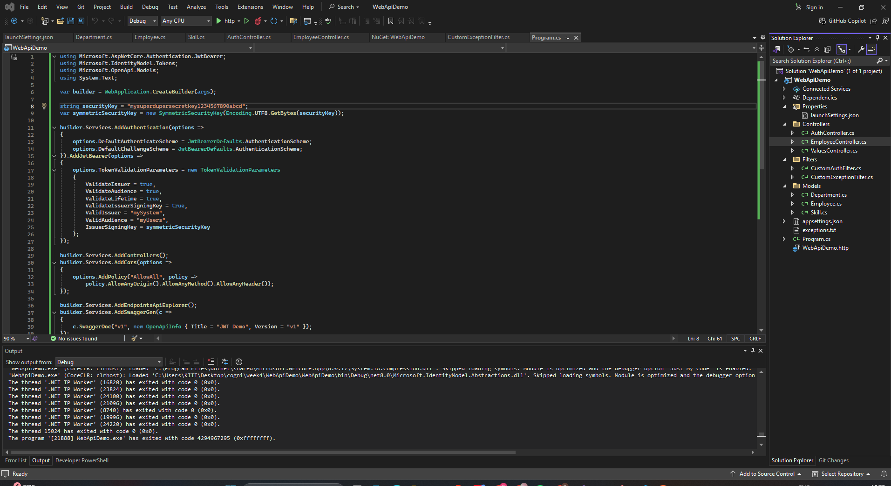

# ✅ ASP.NET Core Web API – Assignment 5: JWT Authentication & Role-Based Authorization

This project demonstrates how to **secure a Web API** using **JWT (JSON Web Token)**, implement **role-based access control**, and test with **Swagger** and **Postman**.

---

## 📘 Objectives

- ✅ Understand what **CORS** is and how to enable it
- ✅ Learn how to set up **JWT authentication** in ASP.NET Core
- ✅ Use `[Authorize]` with roles (`Admin`, `POC`) to secure controllers
- ✅ Create and use JWT tokens using `AuthController`
- ✅ Configure **Swagger** and **Postman** to send secured API requests
- ✅ Test **token expiration** and **unauthorized access**

---

## 🛠 Prerequisites

- Visual Studio 2022 or later
- .NET 6 or 7 SDK
- Postman installed
- Swagger UI enabled
- Browser (Edge/Chrome)

---

## 🚀 Running the Project

1. Open the solution in **Visual Studio**
2. Press `F5` or `Ctrl + F5` to start the Web API
3. Swagger will open at:
   ```
   http://localhost:5167/swagger
   ```

---

## 🔐 JWT Authentication Configuration

### `Program.cs`

- Configures JWT validation with:
  - Issuer: `mySystem`
  - Audience: `myUsers`
  - Secret key: `"mysuperdupersecretkey1234567890abcd"`
- Enables CORS (`AllowAll`) and Swagger
- Registers `UseAuthentication()` and `UseAuthorization()`

---

### 📂 Controllers

#### ✅ `AuthController.cs`

- `[AllowAnonymous]` endpoint to generate a **JWT token**
- Adds:
  - Role: `Admin`
  - Claim: `UserId`
  - Expiration: `2 minutes`

#### ✅ `EmployeeController.cs`

- Protected using `[Authorize(Roles = "Admin,POC")]`
- Supports:
  - `GET`: Get employee list
  - `POST`: Add new employee
  - `PUT`: Update existing employee

---

### 📂 Models

- `Employee.cs` — full employee model
- `Department.cs` — nested in `Employee`
- `Skill.cs` — list of skills in `Employee`

---

## 📤 API Endpoints

| Method | Endpoint                       | Auth Required | Description                |
|--------|--------------------------------|----------------|----------------------------|
| GET    | `/api/auth/token`             | ❌ No          | Generates JWT token        |
| GET    | `/api/employee`               | ✅ Yes (Admin) | Returns list of employees  |
| POST   | `/api/employee`               | ✅ Yes (Admin) | Adds new employee          |
| PUT    | `/api/employee/{id}`          | ✅ Yes (Admin) | Updates employee by ID     |

---

## 🧪 Testing Instructions in Postman

1. **Generate Token**  
   - `GET http://localhost:5167/api/auth/token`
   - Copy value from `"token"`

2. **Access Secured API**
   - Use `GET http://localhost:5167/api/employee`
   - Go to Authorization tab → Type: `Bearer Token`
   - Paste token
   - Click **Send** → ✅ 200 OK

3. **Test Expired Token**
   - Wait 2+ minutes → send again
   - ✅ 401 Unauthorized

4. **Test Role Mismatch**
   - Change `[Authorize(Roles = "POC")]` temporarily
   - Use token with `"Admin"` → ✅ 401 Unauthorized

---

## 🔐 Swagger JWT Setup (Optional)

You can enhance Swagger to support token input:

- Adds `"Authorize 🔒"` button to Swagger UI
- Paste the token and authorize all endpoints
---


## 🖼️ Code Screenshot

📌 *Screenshot of Visual Studio:*  


---

## 📤 Output Screenshot

### **Swagger UI Screenshot**

### **Postman UI Screenshot**


---