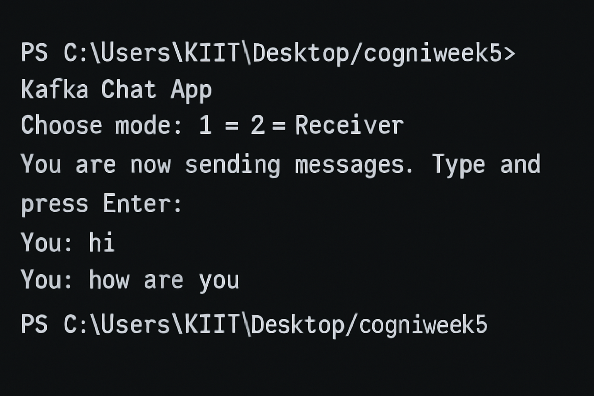

# ✅ Kafka Chat Application using C#

## 📘 Objective  
Create a simple real-time chat application using **Apache Kafka** with **C#**. This app allows users to act either as **Sender (Producer)** or **Receiver (Consumer)** to exchange messages through Kafka topics on the terminal.

---

## 🗂️ Files Included

- `Program.cs` — Console application with sender and receiver logic using **Confluent.Kafka** client library.
- **Kafka setup** — Assumes Kafka and Zookeeper are running on `localhost:9092`.

---

## 🧱 Application Features

| Feature               | Description                                           |
|------------------------|-------------------------------------------------------|
| Producer Mode          | Send messages to Kafka topic via terminal             |
| Consumer Mode          | Receive messages live from Kafka topic in terminal    |
| Clean Exit             | Producer stops on `exit` keyword, Consumer on `Ctrl+C`|
| Asynchronous Producer  | Uses `ProduceAsync()` for non-blocking message send   |
| Cancellation Token     | Graceful shutdown of consumer on Ctrl+C               |

---

## 🚀 How It Works

### 🔹 Sender Mode (Producer)
- Sends messages to Kafka **chat-topic**
- Input stops if user types `exit`

### 🔹 Receiver Mode (Consumer)
- Listens to **chat-topic** and prints incoming messages
- Stops when pressing `Ctrl+C`

---

## 📝 Program Flow

```
1️⃣ App starts ➡️ prompts user for mode
2️⃣ Mode 1 ➡️ Starts Producer ➡️ sends messages to Kafka
3️⃣ Mode 2 ➡️ Starts Consumer ➡️ listens for new messages
4️⃣ Graceful exit on `exit` or `Ctrl+C`
```

---

## ⚙️ Kafka Setup Required

### ✅ Kafka Server:
```bash
.\bin\windows\zookeeper-server-start.bat .\config\zookeeper.properties
.\bin\windows\kafka-server-start.bat .\config\server.properties
```

### ✅ Create Kafka Topic:
```bash
kafka-topics.bat --create --topic chat-topic --bootstrap-server localhost:9092 --partitions 1 --replication-factor 1
```

---

## 🖥️ How To Run

1. **Start Kafka and Zookeeper**
2. Open terminal:
```bash
dotnet run
```
3. Choose:
   - `1` to act as sender
   - `2` to act as receiver

---

## 📤 Output Screenshots

