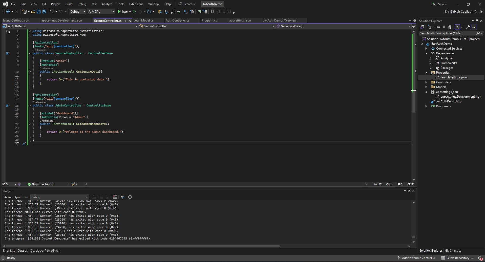

# ✅ ASP.NET Core Web API – Assignment: JWT Authentication & Role-Based Authorization

This project demonstrates how to **secure a Web API** using **JWT (JSON Web Token)** in ASP.NET Core, implement **role-based access control**, and test authentication/authorization using **Swagger**.

---

## 📘 Objectives

- ✅ Understand and implement **JWT authentication**.
- ✅ Add user login with token generation and roles.
- ✅ Secure endpoints with `[Authorize]` and `[Authorize(Roles = "Admin")]`.
- ✅ Test protected API endpoints in **Swagger UI**.
- ✅ Demonstrate responses for unauthorized and expired tokens.

---

## 🛠 Prerequisites

- Visual Studio 2022 or later
- .NET 6 or 8 SDK
- Swagger UI (integrated in ASP.NET Core Web API projects)
- (Optional) Postman

---

## 🚀 Running the Project

1. Open the solution in **Visual Studio**.
2. Press `F5` to run the API.
3. Swagger UI will appear, typically at:


---

## 📂 Controllers

#### ✅ `AuthController.cs`
- `[HttpPost("login")]` endpoint.
- Authenticates user, generates JWT token with "Admin" role.
- Error handling for key length and expiry.

#### ✅ `SecureController.cs`
- `[Authorize]` endpoint: `/api/secure/data`.
- Accessible only with a valid JWT.

#### ✅ `AdminController.cs`
- `[Authorize(Roles = "Admin")]` endpoint: `/api/admin/dashboard`.
- Accessible only for tokens with the "Admin" role.

---

## 📂 Models

- `LoginModel.cs` — Model for login requests (`Username`, `Password`).

---

## 📤 API Endpoints
```
| Method | Endpoint                     | Auth Required      | Description                      |
|--------|-----------------------------|--------------------|----------------------------------|
| POST   | `/api/auth/login`           | ❌ No              | Login, receive JWT token         |
| GET    | `/api/secure/data`          | ✅ Yes             | Protected data                   |
| GET    | `/api/admin/dashboard`      | ✅ Admin only      | Admin-only dashboard             |
```
---

## 🧪 Testing Instructions

1. **Login to get JWT Token**
   - `POST` `/api/auth/login` with:
     ```
     {
       "username": "admin",
       "password": "password"
     }
     ```
   - Copy the token from the response.

2. **Authorize in Swagger UI**
   - Click "Authorize" (padlock).
   - Enter `Bearer <your_token_here>`.

3. **Access Protected Endpoints**
   - **Without** token: 401 Unauthorized.
   - **With** token:
     - `/api/secure/data` → 200 OK.
     - `/api/admin/dashboard` → 200 OK (must have `"role": "Admin"` in token).

4. **Token Expiry Test**
   - Wait until token expires (or adjust code to create a near-expired token).
   - Retry: expect 401 Unauthorized with `Token-Expired: true` header.

---

## 🖼️ Code Screenshot

**Visual Studio Structure, Controllers, and Models:**


---

## 📤 Output Screenshots

### **Swagger UI Screenshot**


### **Postman UI Screenshot**


---


