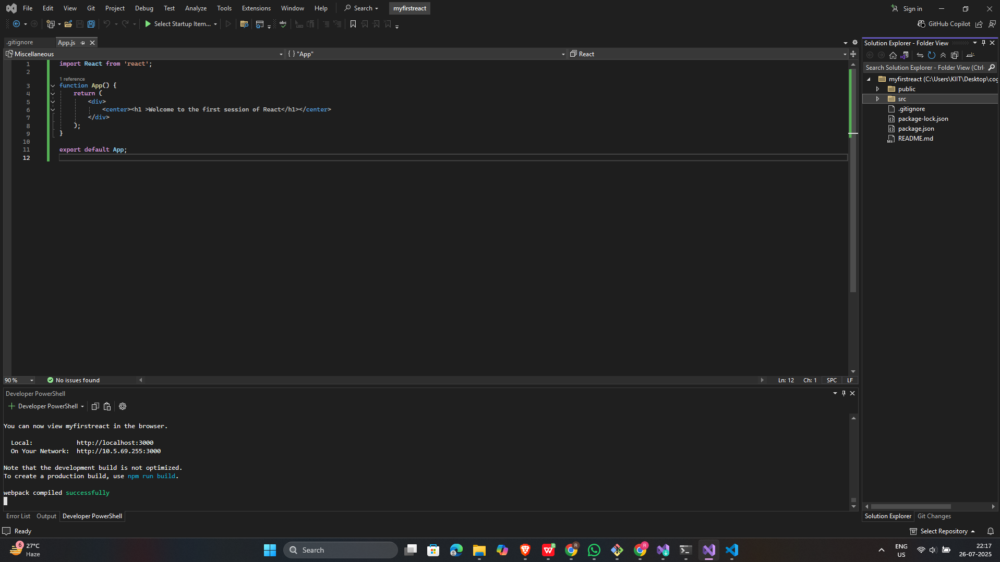
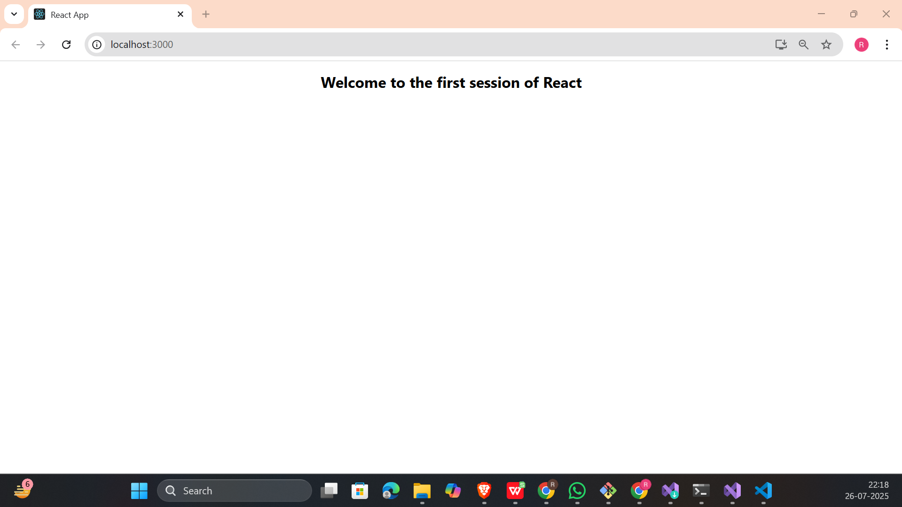

## 📘 React Hands-on - 1 Solution 

## 📘 Objectives

### ✅ 1. Define SPA and its benefits

A **Single Page Application (SPA)** is a type of web application that loads a single HTML page and dynamically updates content as the user interacts with the app, without reloading the entire page from the server.

**Benefits:**
- Faster navigation and interaction
- Better user experience with seamless transitions
- Reduces server load and network usage
- Efficient use of client-side resources

---

### ✅ 2. Define React and identify its working

**React** is a JavaScript library developed by Facebook for building user interfaces. It allows developers to create large web applications that can change data without reloading the page.

**How it works:**
- React uses a **component-based architecture** where the UI is broken into independent, reusable pieces.
- Uses a **virtual DOM** to detect changes and update only the changed parts of the actual DOM.
- Updates are handled through a process called **reconciliation** for better performance.

---

### ✅ 3. Identify the differences between SPA and MPA

| Feature         | SPA (Single Page Application)             | MPA (Multi Page Application)               |
|----------------|--------------------------------------------|--------------------------------------------|
| Navigation     | Client-side, no full reload                | Server-side, full page reloads             |
| Performance    | Faster after initial load                  | Slower due to multiple reloads             |
| Development    | Uses JavaScript frameworks like React      | Traditional web architecture               |
| SEO            | Requires workarounds for indexing          | Easier for search engines to index         |
| User Experience| Smooth and app-like                        | Flickers during page transitions           |

---

### ✅ 4. Explain Pros & Cons of Single-Page Application

**Pros:**
- Improved performance after first load
- Seamless, app-like user experience
- Easier to develop and debug as a single unit

**Cons:**
- Initial loading time can be longer
- SEO optimization is challenging
- Browser history and analytics need special handling
- JavaScript must be enabled for functionality

---

### ✅ 5. Explain about React

**React** is an open-source JavaScript library used to build user interfaces, particularly for SPAs. It enables developers to build reusable UI components.

**Key Points:**
- Developed and maintained by Facebook
- Component-based architecture
- Makes use of **JSX** (JavaScript + XML)
- Supports server-side rendering and mobile app development via React Native
- Efficient DOM updates via Virtual DOM

---

### ✅ 6. Define Virtual DOM

The **Virtual DOM** is a programming concept where a virtual representation of the real DOM is kept in memory and synced with the real DOM by a library like React using a process called **diffing**.

**Advantages:**
- Speeds up DOM manipulation
- Reduces reflows and repaints in the browser
- Makes UI updates faster and more efficient

---

### ✅ 7. Explain Features of React

- **JSX (JavaScript XML):** Allows writing HTML in JavaScript.
- **Components:** Reusable, self-contained UI blocks.
- **Virtual DOM:** Improves performance by reducing direct DOM updates.
- **One-way data binding:** Ensures data flows in one direction, making debugging easier.
- **Declarative UI:** React describes what the UI should look like for a given state.
- **Hooks (from React 16.8+):** Enables state and side effects in functional components.
- **Strong ecosystem:** Includes tools like React Router, Redux, and support for testing.
---

## 🛠 Prerequisites

- Node.js and npm installed from [https://nodejs.org/en/download/](https://nodejs.org/en/download/)
- Microsoft Visual Studio 2022 Community Edition
- Node.js development workload enabled in Visual Studio
- Internet connection for Create React App installation

---

## 📁 Project Structure
```
myfirstreact/
├── public/
├── src/
│   └── App.js
├── package.json
├── package-lock.json
├── .gitignore
└── README.md
```
---
## 🖼️ Code Screenshot
📌 *Screenshot of Visual Studio:* 


## 📤 Output Screenshot
