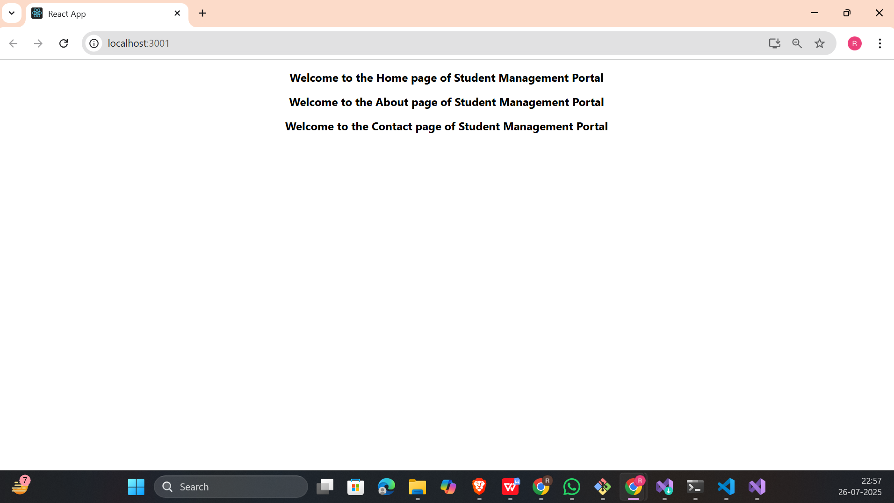

## 📘 React Hands-on - 2 Solution

## 📘 Objectives

### ✅ 1. Explain React Components

**React components** are independent, reusable building blocks used to define pieces of the UI in a React application. Each component can contain HTML, CSS, and JavaScript logic.

**Types:** Class components and Function components.

---

### ✅ 2. Identify the differences between components and JavaScript functions

| Feature                  | React Component                              | JavaScript Function                      |
|--------------------------|-----------------------------------------------|-------------------------------------------|
| Purpose                 | Defines a part of the UI                      | Performs a task or returns a value        |
| JSX support             | Yes                                           | No                                        |
| Lifecycle methods       | Available (in class components)              | Not applicable                            |
| Used in rendering UI    | Yes                                           | Not used for rendering                    |
| Can hold state          | Yes (in class or via Hooks in functions)     | No                                        |

---

### ✅ 3. Identify the types of components

1. **Class Components** – Use ES6 classes, support lifecycle methods, `this.state`.
2. **Function Components** – Stateless earlier, but now support state and effects using **Hooks** (`useState`, `useEffect`, etc.).

---

### ✅ 4. Explain Class Component

A **Class Component** is a JavaScript class that extends `React.Component`. It must include a `render()` method to return JSX.

```js
class Home extends React.Component {
  render() {
    return <h1>Hello from Home</h1>;
  }
}
```
---
### ✅ 5. Explain Function Component

A **Function Component** is a simpler way to write components using JavaScript functions. From React 16.8 onward, Hooks can be used to manage state and lifecycle logic.

```
function Home() {
  return <h1>Hi from Home</h1>;
}
```
---
### ✅ 6. Define Component Constructor

The **constructor** in a class component initializes state and binds methods.

```
constructor(props) {
  super(props);
  this.state = { name: "Student" };
}
```
---
### ✅ 7. Define render() function

The **render()** method is mandatory in a class component. It returns the JSX that defines the UI

```
render() {
  return <div>Hello World</div>;
}
```
---
## 🛠 Prerequisites

- Node.js and npm installed from https://nodejs.org/en/download/
- Microsoft Visual Studio 2022 Community Edition
- Node.js development workload enabled in Visual Studio
- Internet connection for Create React App installation

---

## 📁 Project Structure
```
StudentApp/
├── public/
├── src/
│   ├── App.js
│   ├── Components/
│   │   ├── Home.js
│   │   ├── About.js
│   │   └── Contact.js
├── package.json
├── package-lock.json
├── .gitignore
└── README.md
```
---

## 🖼️ Code Screenshot
📌 *Screenshot of Visual Studio:* 

---
## 📤 Output Screenshot

---