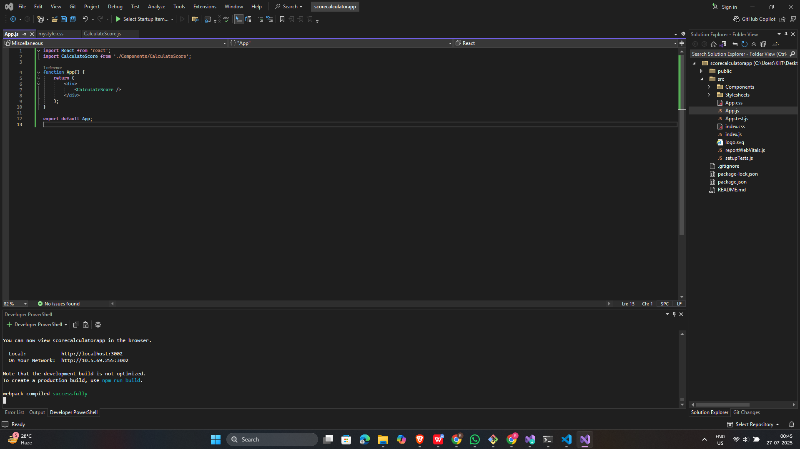
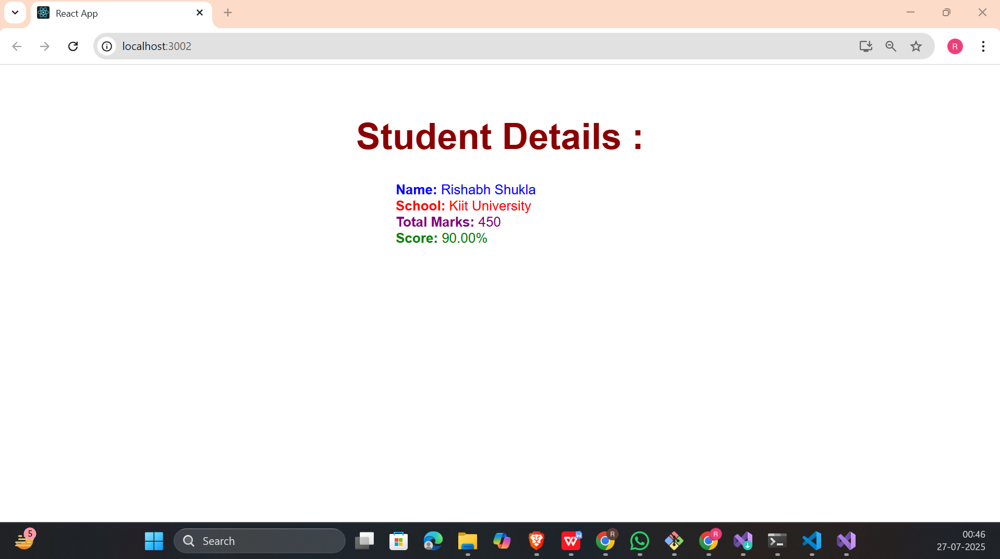

# 📘 React Hands-on - 3 Solution

## 📘 Objectives

### ✅ 1. Explain React components

**React components** are building blocks of any React application. They encapsulate UI elements and logic, allowing reuse and modularity. Components can be class-based or function-based.

---

### ✅ 2. Identify the differences between components and JavaScript functions

| Feature             | React Component                       | JavaScript Function               |
|---------------------|----------------------------------------|-----------------------------------|
| Purpose             | Creates UI elements                   | Executes logic or returns value  |
| Syntax              | JSX and lifecycle-aware               | Pure JavaScript                  |
| React Integration   | Yes, part of rendering                | No                               |
| State Management    | Can manage state                      | Cannot                           |
| Reusability in UI   | High                                  | Not directly used for UI         |

---

### ✅ 3. Identify the types of components

- **Class Components** – ES6 classes extending `React.Component`, can use lifecycle methods and `state`.
- **Function Components** – Modern and concise. Can use **Hooks** to manage state and effects.

---

### ✅ 4. Explain Class Component

A **Class Component** is created using JavaScript class syntax. It includes a `render()` method and can manage its own state.

```js
class Example extends React.Component {
  render() {
    return <h1>Hello</h1>;
  }
}
```
---

### ✅ 5. Explain Function Component

A **Function Component** is a JavaScript function that returns JSX. It can use Hooks for state and side-effects.

```js
function Example() {
  return <h1>Hello</h1>;
}
```
---

### ✅ 6. Define Component Constructor

The **constructor** method in class components initializes state and binds event handlers. It's called before the component is mounted.

```js
constructor(props) {
  super(props);
  this.state = { name: "Student" };
}
```
---

### ✅ 7. Define render() function

The  **render()** method is used in class components to define what JSX should be displayed.

```js
render() {
  return <div>Hello World</div>;
}
```
---
## 🛠 Prerequisites

- Node.js and npm installed from https://nodejs.org/en/download/
- Microsoft Visual Studio 2022 Community Edition
- Node.js development workload in Visual Studio

---

## 📁 Project Structure
```
scorecalculatorapp/
├── public/
├── src/
│   ├── App.js
│   ├── Components/
│   │   └── CalculateScore.js
│   ├── Stylesheets/
│   │   └── mystyle.css
├── package.json
├── .gitignore
└── README.md
```
---

## 🖼️ Code Screenshot
📌 *Screenshot of Visual Studio:* 

---
## 📤 Output Screenshot

---