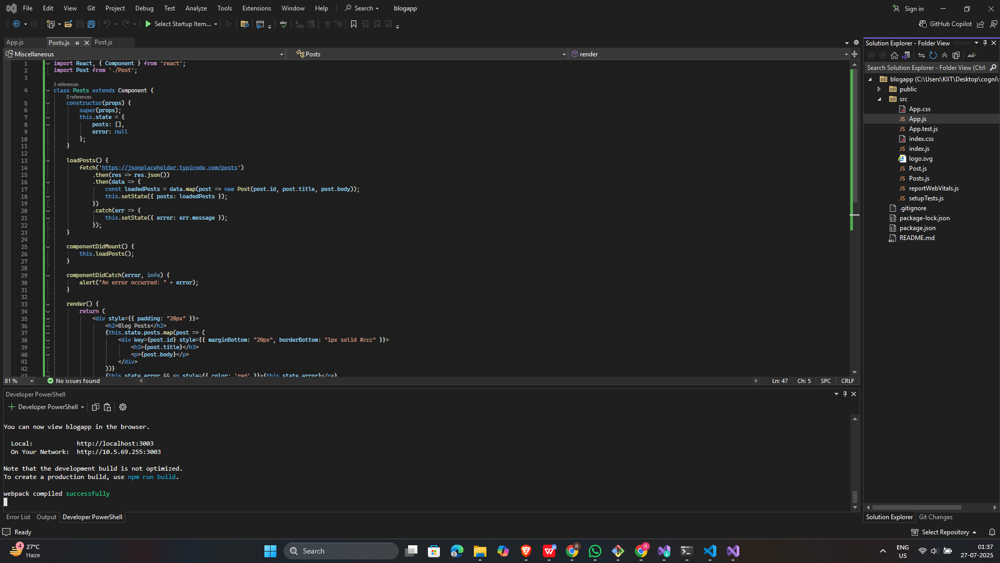
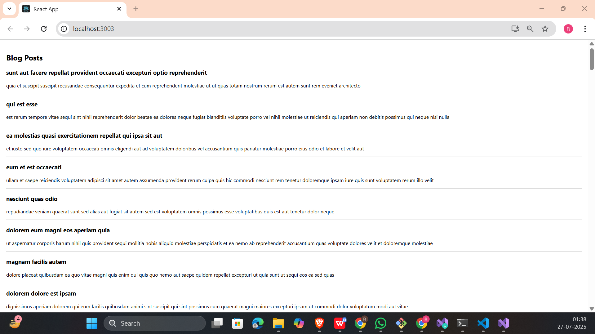

# 📘 React Hands-on - 4 Solution

## 📘 Objectives

### ✅ 1. Explain the need and benefits of component life cycle

React components go through a **lifecycle of mounting, updating, and unmounting**. Lifecycle methods let you execute code at specific points in this process.

**Benefits:**
- Load data as soon as a component mounts
- Handle errors during rendering or API failures
- Manage cleanup on unmount (e.g., remove timers, listeners)
- Control when and how the UI updates

---

### ✅ 2. Identify various life cycle hook methods

| Phase         | Lifecycle Method           | Description                                          |
|---------------|----------------------------|------------------------------------------------------|
| Mounting      | `constructor()`            | Initializes state and binds functions               |
|               | `componentDidMount()`      | Called once after component is rendered             |
| Updating      | `shouldComponentUpdate()`  | Controls whether to re-render or not                |
|               | `componentDidUpdate()`     | Called after component updates                      |
| Unmounting    | `componentWillUnmount()`   | Cleanup before component is removed                 |
| Error Handling| `componentDidCatch()`      | Catches render errors and displays fallback UI      |

---

### ✅ 3. List the sequence of steps in rendering a component

1. `constructor()` — Initializes state
2. `render()` — JSX returned and displayed
3. `componentDidMount()` — API calls or setup logic runs
4. If state/props change → re-renders via `render()`
5. On unmount, `componentWillUnmount()` is called
6. If an error occurs in rendering, `componentDidCatch()` is triggered

---

## 🛠 Prerequisites

- Node.js and npm installed from [https://nodejs.org/en/download/](https://nodejs.org/en/download/)
- Microsoft Visual Studio 2022 Community Edition
- Node.js workload enabled in Visual Studio

---

## 📁 Project Structure

```
blogapp/
├── public/
├── src/
│ ├── App.js
│ ├── Post.js
│ ├── Posts.js
├── package.json
├── .gitignore
└── README.md
```

---

## 🧠 Key Concepts Implemented

| Feature                | File       | Description                                       |
|------------------------|------------|---------------------------------------------------|
| Class Component        | `Posts.js` | Uses `Component` and state                        |
| Lifecycle - Mount      | `componentDidMount()` | Fetches posts from API                 |
| Lifecycle - Error      | `componentDidCatch()` | Alerts on error during rendering       |
| API Integration        | `loadPosts()` method | Fetches from JSONPlaceholder API       |
| Data Class             | `Post.js`  | Holds individual post details                    |
| Render Logic           | `render()` | Dynamically displays post title and body         |

---

## 🖼️ Code Screenshot

📌 *Visual Studio Project Folder View:*  


---

## 📤 Output Screenshot

📌 *Browser Output with Rendered Posts:*  


---


