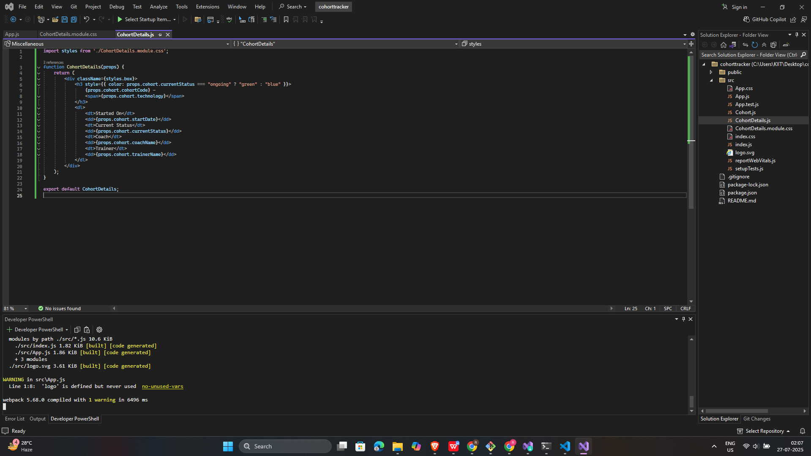

# 📘 React Hands-on - 5 Solution

## 📘 Objectives

### ✅ 1. Understanding the need for styling React components

Styling improves the visual clarity, structure, and usability of React components. In real-world applications, clean and consistent styling is essential for better UX and maintainability.

---

### ✅ 2. Working with CSS Module and inline styles

React supports multiple styling approaches:
- **CSS Modules**: Enable scoped styles by importing `.module.css` files.
- **Inline Styles**: Use JavaScript objects to apply dynamic or conditional styles directly within JSX.

This lab combines both methods to style the `CohortDetails` component.

---

## 🛠 Prerequisites

- Node.js and npm installed from [https://nodejs.org/en/download/](https://nodejs.org/en/download/)
- Microsoft Visual Studio 2022 Community Edition
- Node.js development workload enabled

---

## 🎯 Lab Goal

Style a given React component named `CohortDetails` using:
- ✅ A CSS Module for base layout (`.box` class)
- ✅ Inline styles for conditional heading color

---

## 📁 Project Structure
```
cohort-dashboard/
├── public/
├── src/
│ ├── App.js
│ ├── CohortDetails.js
│ ├── CohortDetails.module.css
├── package.json
└── README.md
```


---

## 💻 Component Behavior

- Component receives `props.cohort` (with properties like `cohortCode`, `technology`, `status`, etc.)
- If `currentStatus === "ongoing"` → heading color is green
- Otherwise → heading color is blue
- The component is wrapped in a styled `.box` container using a CSS Module

---

## 🎨 CSS Used – `CohortDetails.module.css`

```css
.box {
  width: 300px;
  display: inline-block;
  margin: 10px;
  padding: 10px 20px;
  border: 1px solid black;
  border-radius: 10px;
}

dt {
  font-weight: 500;
}
```
---
## 🖼️ Code Screenshot

📌 *Visual Studio Project Folder View:*  


---

## 📤 Output Screenshot

📌 *Final rendered cohort cards with dynamic color and styles:*

---