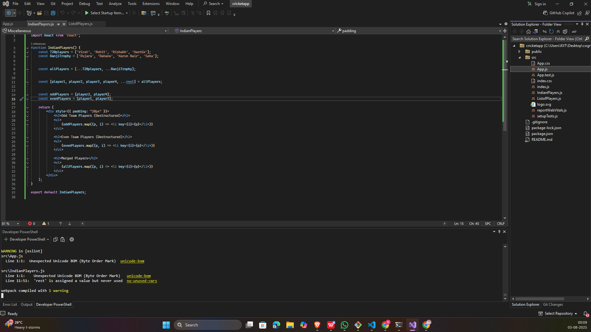
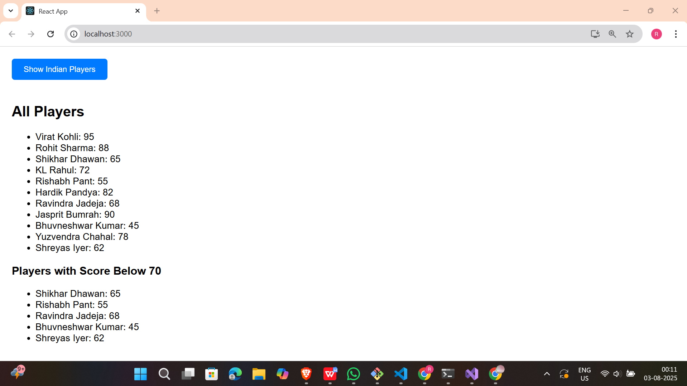
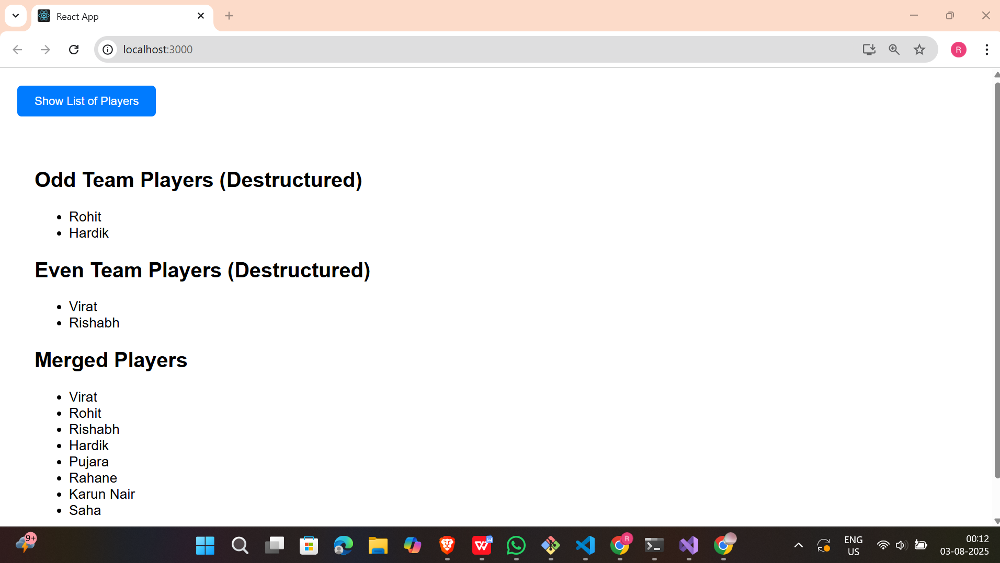

# 📘 React Hands-on - 9 Solution

## 📘 Objectives

### ✅ 1. List the features of ES6

**ES6** (ECMAScript 2015) introduced several powerful features to JavaScript:

- `let` and `const` for block-scoped variable declarations
- Arrow functions (`=>`)
- Template literals
- Destructuring assignment
- Classes and inheritance
- `map()`, `set()`, and `forEach()` for better data handling
- Spread (`...`) and rest (`...`) operators
- Promises for async operations
- Modules (`import`, `export`)

---

### ✅ 2. Explain JavaScript `let`

**let** declares a block-scoped variable and can be updated but not re-declared in the same scope.

```js
let score = 100;
score = 90; // ✅ allowed
```
---

### ✅ 3. Difference between `var` and `let`
```
| Feature       | `var`                    | `let`                       |
| ------------- | ------------------------ | --------------------------- |
| Scope         | Function-scoped          | Block-scoped                |
| Hoisting      | Hoisted with `undefined` | Hoisted but not initialized |
| Redeclaration | Allowed                  | Not allowed                 |
```

---
### ✅ 4. Explain JavaScript `const`

**const** is used to declare variables whose value cannot be reassigned. The variable must be initialized when declared.
```js
const MAX_SCORE = 100;
// MAX_SCORE = 80; ❌ Error
```
---

### ✅ 5. Explain ES6 class fundamentals

- Defined using the class keyword
- Can contain a constructor and methods
- this keyword refers to the current instance
```js
class Player {
  constructor(name) {
    this.name = name;
  }
  greet() {
    return `Hi, ${this.name}`;
  }
}
```
---

### ✅ Explain ES6 class inheritance

**extends** allows one class to inherit properties/methods from another.

```js
class Batsman extends Player {
  play() {
    return `${this.name} is batting`;
  }
}
```
---

### ✅ 7. Define ES6 arrow functions

Arrow functions provide a concise syntax and lexical **this** binding.

```js
const greet = name => `Hi, ${name}`;
```
---

### ✅ 8. Identify `set()`, `map()`

- set() → Collection of unique values

- map() → Collection of key-value pairs

```js
let mySet = new Set([1, 2, 2, 3]); // {1, 2, 3}
let myMap = new Map();
myMap.set("name", "Virat");       // {"name" => "Virat"}
```
---

## 🛠 Prerequisites

- Node.js and npm installed from [https://nodejs.org/en/download/](https://nodejs.org/en/download/)
- Microsoft Visual Studio 2022 Community Edition
- Node.js development workload enabled

---

## 📁 Project Structure
```
cricketapp/
├── public/
├── src/
│   ├── App.js
│   ├── ListofPlayers.js
│   ├── IndianPlayers.js
├── package.json
└── README.md
```
---

## 🖼️ Code Screenshot

📌 *Visual Studio Project Folder View:* 


---

## 📤 Output Screenshot

📌 *Final output screenshots:*

---
