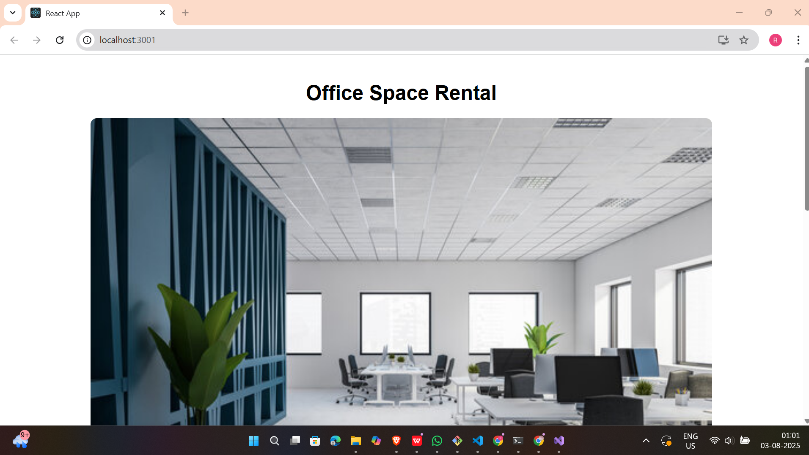

# 📘 React Hands-on - 10 Solution

## 📘 Objectives

### ✅ 1. Define JSX

**JSX (JavaScript XML)** is a syntax extension for JavaScript used in React to describe the UI. It allows writing HTML-like code within JavaScript.

```jsx
const heading = <h1>Welcome</h1>;
```
---

### ✅ 2. Explain about ECMAScript (ES)

**ECMAScript (ES)** is the scripting standard for JavaScript defined by ECMA International. React uses ES6+ features like:

- let, const
- Arrow functions
- Classes and inheritance
- Destructuring
- Spread/rest operators

---
### ✅ 3. Explain React.createElement()

It is the underlying method used by JSX.

ex:
```jsx
 React.createElement('h1', null, 'Welcome');
```
Is equivalent to:

```jsx
<h1>Welcome</h1>
```
JSX is syntactic sugar for **React.createElement.**

---
### ✅ 4. Explain how to create React nodes with JSX

You can define React elements like this:

```jsx
const element = <div><h1>Hello</h1></div>;
```
These nodes are rendered to the DOM using JSX, and they can contain logic and dynamic expressions.

---
### ✅ 5. Define how to render JSX to DOM

JSX is compiled to **React.createElement()** calls and rendered using the ReactDOM API:

```jsx
ReactDOM.render(<App />, document.getElementById('root'));
```
---

### ✅ 6. Explain how to use JavaScript expressions in JSX

Expressions are embedded using **{}** inside JSX:
```jsx
const name = "Office";
return <h1>{name} Space</h1>;

```
You can also call functions or perform calculations:
```jsx
{rent < 60000 ? "Low Rent" : "Premium"}

```
---

### ✅ 7. Explain how to use inline CSS in JSX

Inline styles in JSX use JavaScript objects:

```jsx
<h2 style={{ color: "green", fontSize: "20px" }}>Styled Text</h2>

```
---

## 🛠 Prerequisites

- Node.js and npm installed from [https://nodejs.org/en/download/](https://nodejs.org/en/download/)
- Microsoft Visual Studio 2022 Community Edition
- Node.js development workload enabled

---
## 📁 Project Structure
```
officespacerentalapp/
├── public/
├── src/
│   ├── App.js
│   ├── OfficeSpace.js
├── package.json
└── README.md
```
---

## 🖼️ Code Screenshot
📌 *Visual Studio Project Folder View:* 


---

## 📤 Output Screenshot

📌 *Final output screenshots:*

---

---