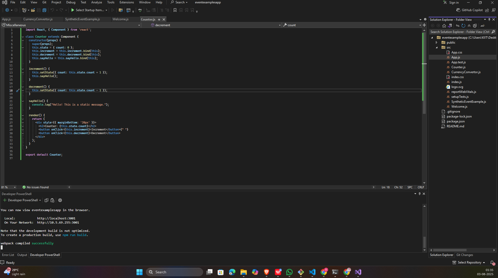
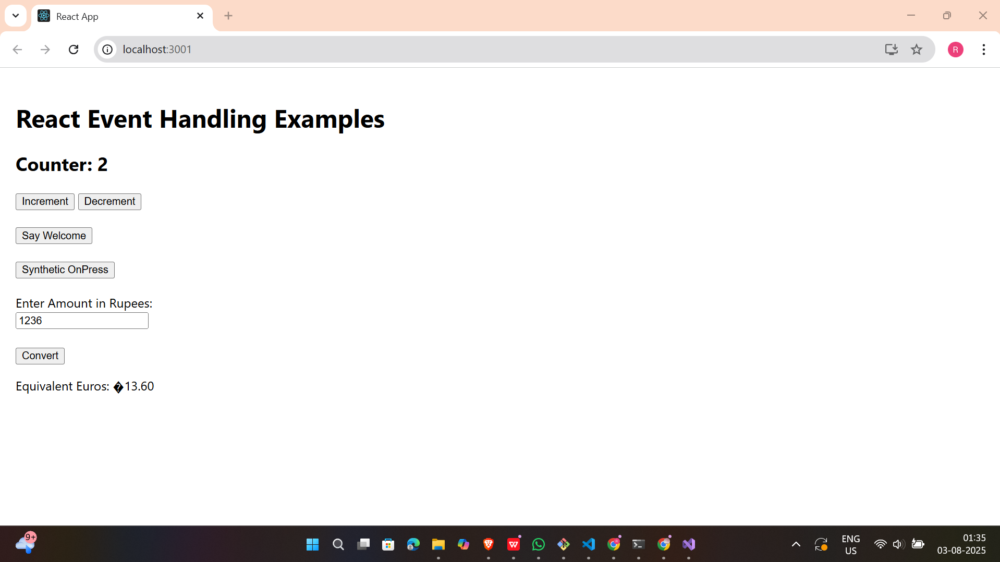

# 📘 React Hands-on - 11 Solution

## 📘 Objectives

### ✅ 1. Explain React events
React events are the way to handle user interactions such as clicks, form submissions, input changes, etc. in a React application. React wraps native DOM events inside a wrapper called **SyntheticEvent**, ensuring consistent behavior across all browsers.

---

### ✅ 2. Explain about event handlers
Event handlers are functions executed when an event occurs. In React, they are passed as props like `onClick`, `onChange`, etc. Example:

```jsx
<button onClick={handleClick}>Click Me</button>
```

---

### ✅ 3. Define Synthetic event

A SyntheticEvent is a cross-browser wrapper around the browser's native event. It normalizes event properties and behavior to work identically across different browsers.

```jsx
function handleClick(e) {
  e.preventDefault(); // synthetic event
}
```

---

### ✅ 4. Identify React event naming convention

React uses camelCase for event handlers (unlike HTML which uses lowercase):
```
| HTML       | React      |
| ---------- | ---------- |
| `onclick`  | `onClick`  |
| `onchange` | `onChange` |
| `onkeyup`  | `onKeyUp`  |

```

---

## 🛠 Prerequisites

- Node.js and npm installed from [https://nodejs.org/en/download/](https://nodejs.org/en/download/)
- Microsoft Visual Studio 2022 Community Edition
- Node.js development workload enabled

---
## 📁 Project Structure
```
eventexamplesapp/
├── public/
├── src/
│   ├── App.js
│   ├── Counter.js
│   ├── Welcome.js
│   ├── SyntheticEventExample.js
│   ├── CurrencyConvertor.js
├── package.json
└── README.md

```
---
## 🖼️ Code Screenshot
📌 *Visual Studio Project Folder View:* 


---

## 📤 Output Screenshot

---