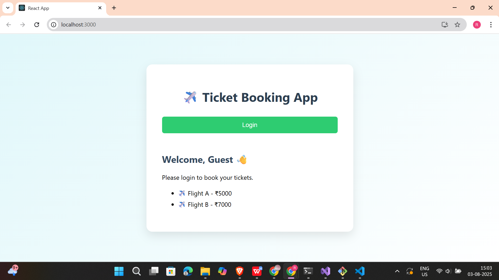
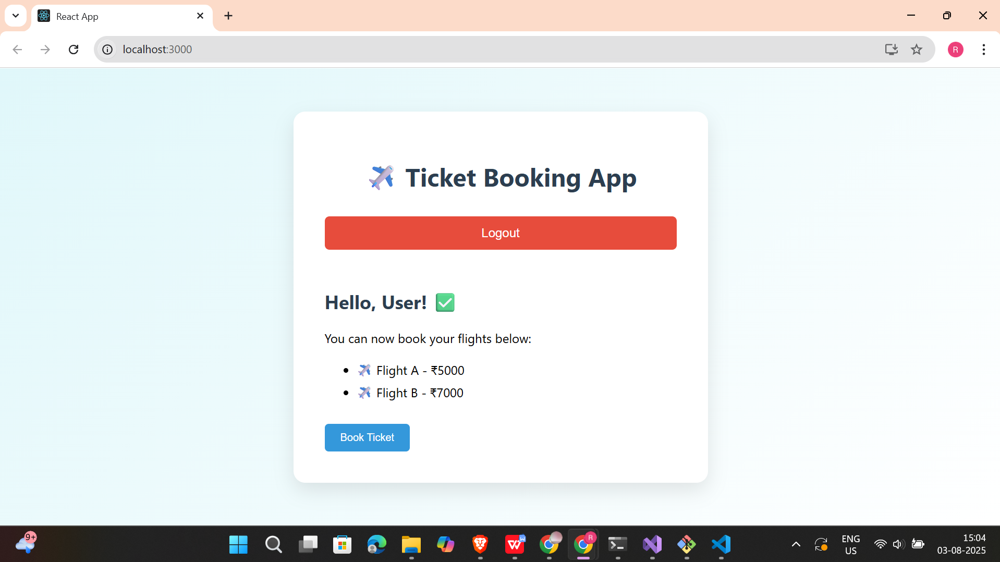

# 📘 React Hands-on - 12 Solution

This lab demonstrates **conditional rendering** in React using **element variables**, **synthetic events**, and **dynamic views** for Guest vs Logged-in users.

---

## 📘 Objectives

### ✅ 1. Explain Conditional Rendering in React

Conditional rendering is the process of rendering components or elements based on conditions (like state or props). It’s done using:

- `if` statements
- ternary operators (`? :`)
- logical operators (`&&`)

```jsx
{isLoggedIn ? <UserPage /> : <GuestPage />}
```
---
### ✅ 2. Define Element Variables

An element variable is a variable assigned JSX content, which can be rendered later.

```jsx
let page;
if (isLoggedIn) {
  page = <UserPage />;
} else {
  page = <GuestPage />;
}
```
---
### ✅ 3. Explain How to Prevent Components from Rendering

To prevent rendering, conditionally exclude the component from the JSX tree. Example:

```jsx
{isVisible && <Component />}
```

This ensures the component is skipped entirely when the condition is false.

---

## 🛠 Prerequisites

- Node.js and npm installed from [https://nodejs.org/en/download/](https://nodejs.org/en/download/)
- Microsoft Visual Studio 2022 Community Edition
- Node.js development workload enabled

---

## 📁 Project Structure
```
ticketbookingapp/
├── public/
├── src/
│   ├── App.js
│   ├── GuestPage.js
│   ├── UserPage.js
├── package.json
└── README.md
```
---
## 🖼️ Code Screenshot
📌 *Visual Studio Project Folder View:* 


---
## 📤 Output Screenshot
📌 *Final output screenshots:*

