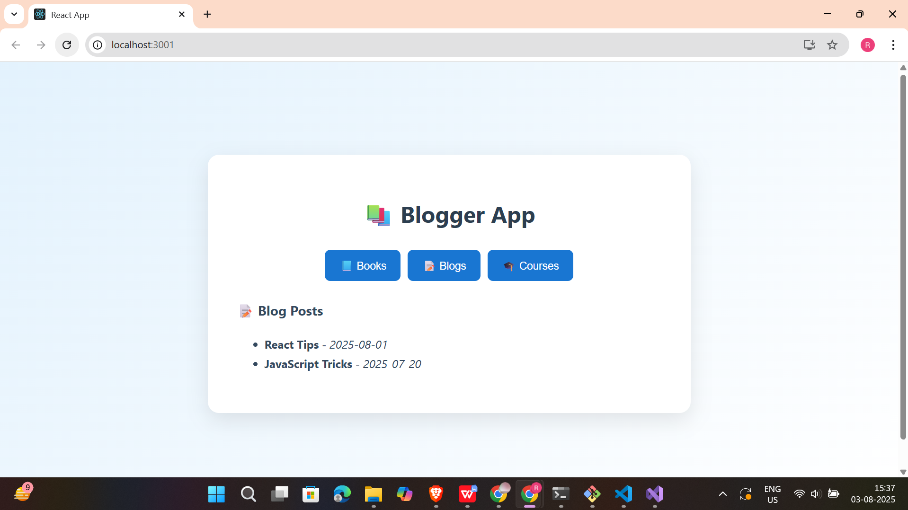
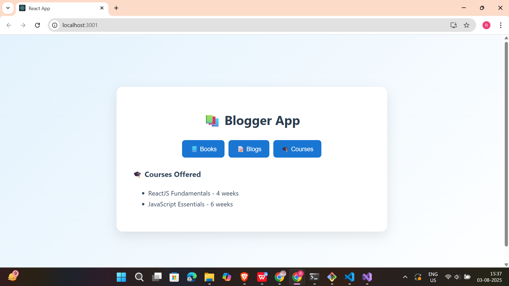

# 📘 React Hands-on - 12 Solution

This lab demonstrates how to use **conditional rendering** and **`map()` with keys** in React to display dynamic lists of books, blogs, and courses — all in a polished, interactive UI.

---

## 📘 Objectives

### ✅ 1. Explain how to render multiple components conditionally

React allows you to render different components based on state or logic using:

```jsx
{condition ? <ComponentA /> : <ComponentB />}
switch(view) {
  case 'blogs': return <BlogDetails />;
  case 'courses': return <CourseDetails />;
}

```
---

### ✅ 2. Explain how to render a list of elements using JSX

Use JavaScript's **map()** method to transform data into JSX:

```jsx 
const items = ['React', 'Vue'];
return (
  <ul>
    {items.map(item => <li>{item}</li>)}
  </ul>
);
```
---

### ✅ 3. Define map() and keys

- **map()** is used to loop through an array and return new JSX elements.
- **key** is a unique identifier that helps React identify which items changed, added, or removed during re-rendering.

```jsx 
array.map(item => <li key={item.id}>{item.name}</li>);
```
---

## 🛠 Prerequisites

- Node.js and npm installed from [https://nodejs.org/en/download/](https://nodejs.org/en/download/)
- Microsoft Visual Studio 2022 Community Edition
- Node.js development workload enabled

---

## 📁 Project Structure

```
bloggerapp/
├── public/
├── src/
│   ├── App.js
│   ├── BookDetails.js
│   ├── BlogDetails.js
│   ├── CourseDetails.js
├── package.json
└── README.md
```
---
## 🖼️ Code Screenshot
📌 *Visual Studio Project Folder View:* 


---

## 📤 Output Screenshot
📌 *Final output screenshots:*

---

---

---