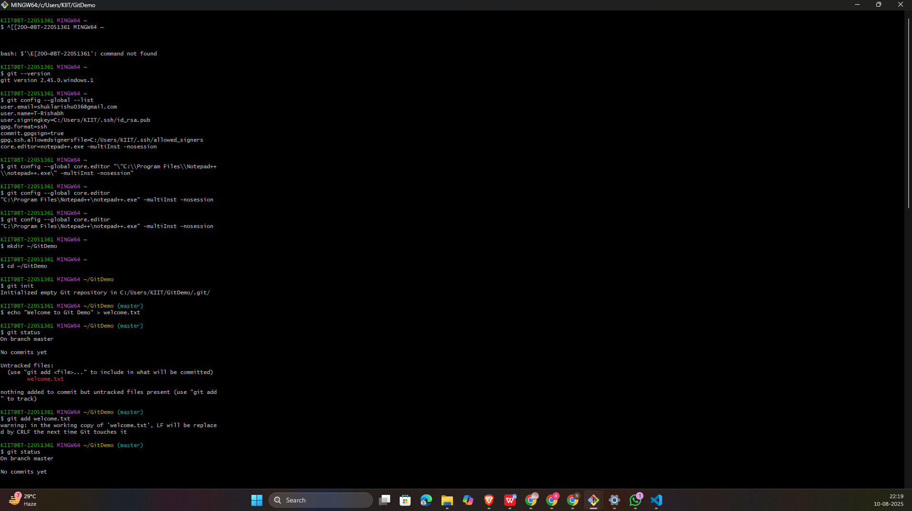
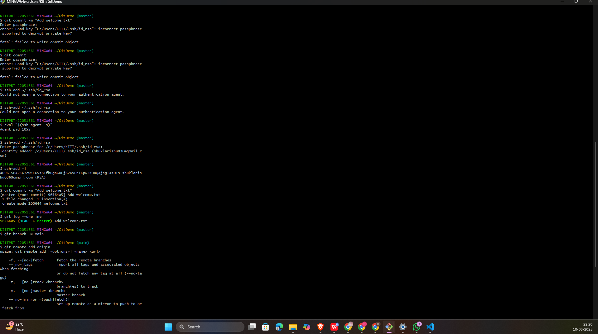
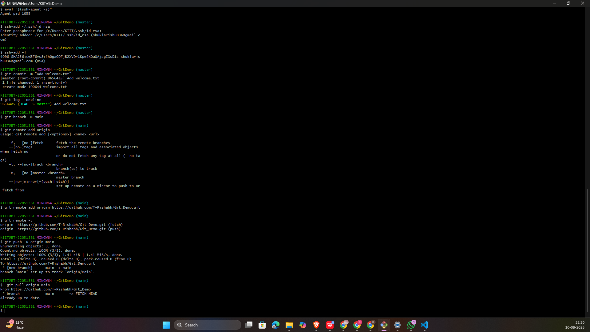

# 🖥️ Git Hands-On Lab — Assignment 1

## 🎯 Objectives
- Learn and practice Git commands:
  - `git init`, `git status`, `git add`, `git commit`, `git push`, `git pull`
- Configure Git on your local machine
- Set **Notepad++** as the default Git editor
- Create a file and push it to a remote repository (GitLab)

---

## 🛠 Prerequisites
- **Git Bash** installed ([Download here](https://git-scm.com/downloads))
- **Notepad++** installed ([Download here](https://notepad-plus-plus.org/))
- Free account on [GitLab](https://gitlab.com)

---

#### 📌 Step 1 — Setup Git Configuration
#### 📌 Step 2 — Integrate Notepad++ as Default Editor
#### 📌 Step 3 — Create Local Repository & Add File
#### 📌 Step 4 — Create Remote Repository (GitLab)
#### 📌 Step 5 — Link Local to Remote & Push
#### 📌 Step 6 — Fixing SSH Passphrase Issues
#### 📌 Step 7 — Pull Changes Later
---

## 🖼️  Screenshots

