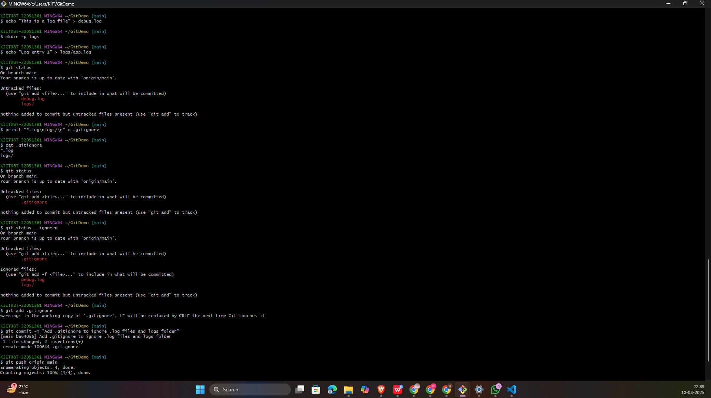

# 🖥️ Git Hands-On Lab — 2

## 🎯 Objectives
- Understand what `.gitignore` is
- Learn how to ignore unwanted files & folders in Git
- Verify ignored files are excluded from commits

---

## 🛠 Prerequisites
- Git environment set up on your system
- **Notepad++** integrated as Git default editor
- A local Git repository linked to a remote repository in GitLab

---
## Steps
#### 📌 Step 1 — Open Your Git Project
#### 📌 Step 2 — Create Unwanted Files & Folders
#### 📌 Step 3 — Check Current Git Status
#### 📌 Step 4 — Create or Edit .gitignore
#### 📌 Step 5 — Verify Ignoring Works
#### 📌 Step 6 — Commit .gitignore
#### 📌 Step 7 — Test Ignoring Behavior
---
## 🖼️  Screenshots

---