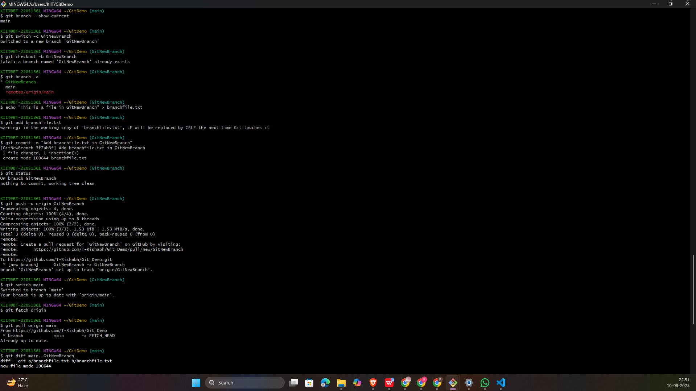
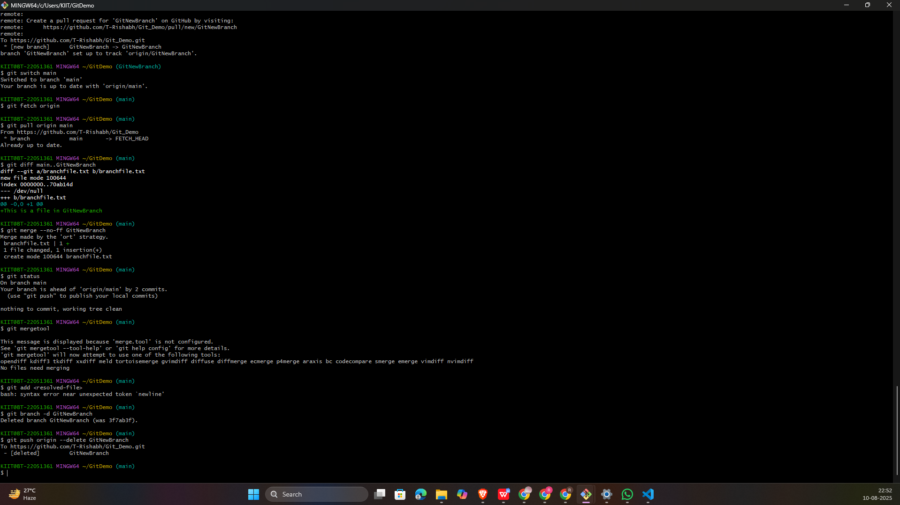

# 🖥️ Git Hands-On Lab — 3

## 🎯 Objectives
- Explain **branching** and **merging**
- Learn to create branches in Git
- Create a **merge request** in GitLab
- View and resolve differences using **P4Merge** tool
- Merge changes back into master/trunk

---

## 🛠 Prerequisites
- Git environment set up
- A local Git repository linked to a GitLab repository

---
## Steps
#### 📌 Step 1 — Create New Branch
#### 📌 Step 2 — Make Changes in the New Branch
#### 📌 Step 3 — Merge Changes Back to Master
#### 📌 Step 4 — Perform Merge
#### 📌 Step 5 — Delete Merged Branch
---
## 🖼️  Screenshots

---