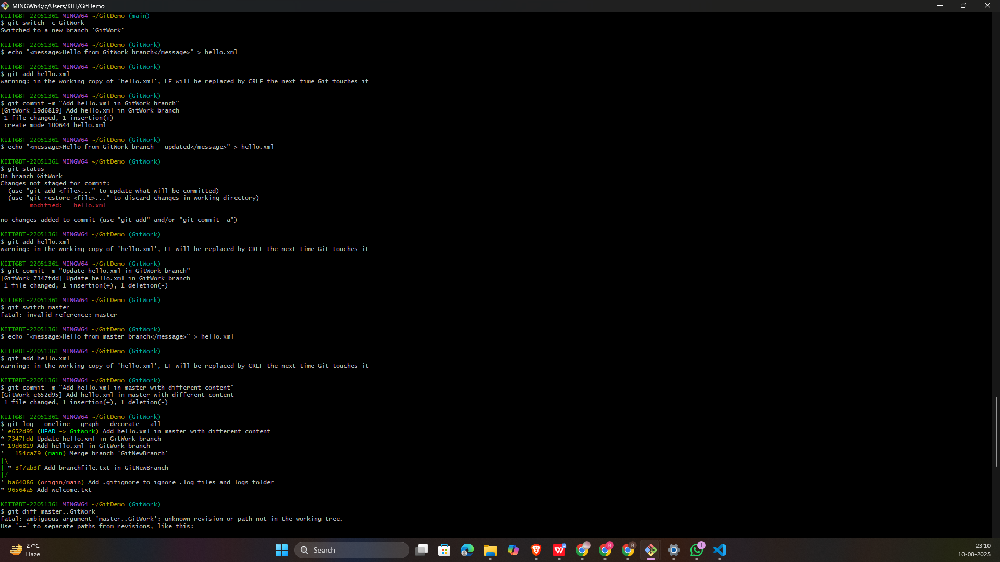
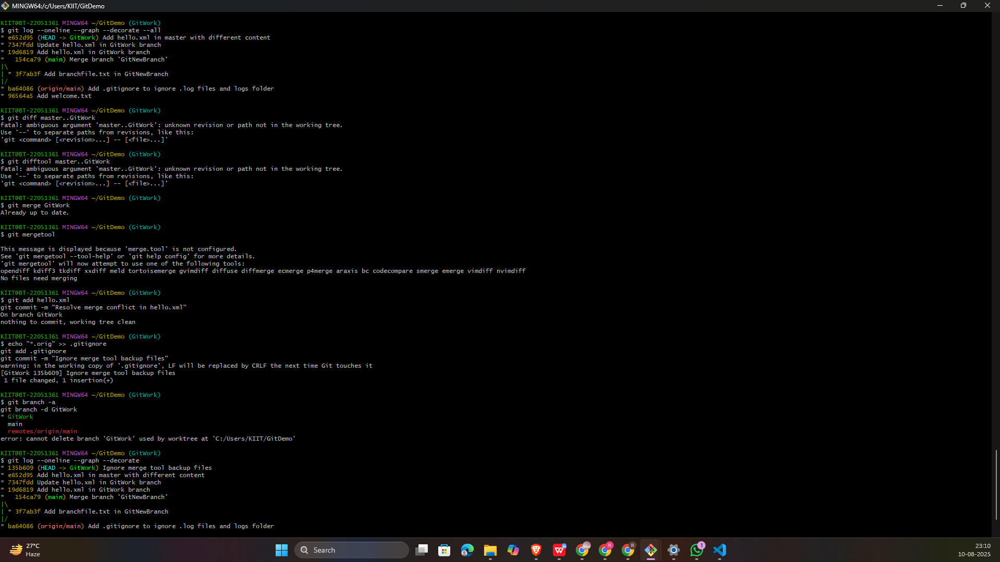

# 🖥️ Git Hands-On Lab — 4

## 🎯 Objectives
- Understand how merge conflicts happen in Git
- Resolve conflicts using CLI and **P4Merge**
- Commit resolved changes and clean up branches

---

## 🛠 Prerequisites
- Git environment set up
- A local Git repository linked to a GitLab repository

---
## Steps
#### 📌 Step 1 — Start from a Clean Master
#### 📌 Step 2 — Create Branch GitWork
#### 📌 Step 3 — Add and Commit hello.xml in GitWork
#### 📌 Step 4 — Modify hello.xml in GitWork
#### 📌 Step 5 — Switch to Master and Add Different Content
#### 📌 Step 6 — View History Graph
#### 📌 Step 7 — Compare Changes
#### 📌 Step 8 — Use P4Merge to Visualize Differences
#### 📌 Step 9 — Merge GitWork into Master (Conflict Happens)
#### 📌 Step 10 — Resolve Conflict Using P4Merge
#### 📌 Step 11 — Stage and Commit Resolved File
#### 📌 Step 12 — Ignore Merge Tool Backup Files
#### 📌 Step 13 — Delete Branch After Merge
#### 📌 Step 14 — View Final Log Graph
---
## 🖼️  Screenshots

---