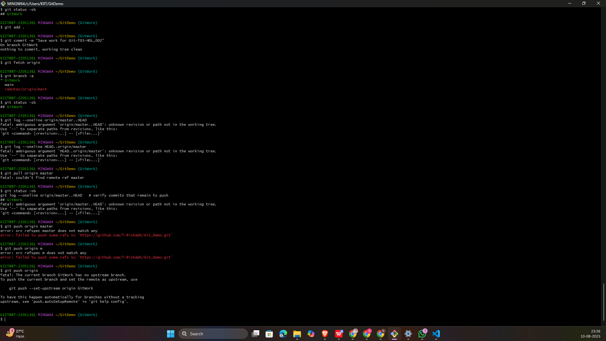

# 🖥️ Git Hands-On Lab — 5

## 🎯 Objectives
- Verify clean state of master branch
- Pull latest changes from remote
- Push pending changes to remote
- Confirm updates in remote repository

---

## 🛠 Prerequisites
- Local Git repository linked to a remote (GitLab)
- Completed **Git-T03-HOL_002** exercise (changes pending to be pushed)

---
## Steps
#### 📌 Step 1 — Verify Master Branch is Clean
#### 📌 Step 2 — List All Available Branches
#### 📌 Step 3 — Pull Latest Remote Changes
#### 📌 Step 4 — Push Pending Changes to Remote
#### 📌 Step 5 — Verify Changes in Remote Repository
---
## 🖼️  Screenshots

---